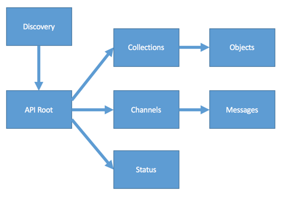
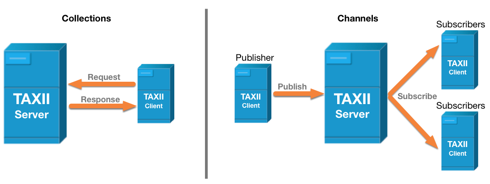

---

# TAXII Version 2.1

## OASIS Standard

### 10 June 2021

#### This stage:

<https://docs.oasis-open.org/cti/taxii/v2.1/os/taxii-v2.1-os.docx> (Authoritative) \
<https://docs.oasis-open.org/cti/taxii/v2.1/os/taxii-v2.1-os.html> \
<https://docs.oasis-open.org/cti/taxii/v2.1/os/taxii-v2.1-os.pdf>

#### Previous stage:

<https://docs.oasis-open.org/cti/taxii/v2.1/cs01/taxii-v2.1-cs01.docx> (Authoritative) \
<https://docs.oasis-open.org/cti/taxii/v2.1/cs01/taxii-v2.1-cs01.html> \
<https://docs.oasis-open.org/cti/taxii/v2.1/cs01/taxii-v2.1-cs01.pdf>

#### Latest stage:

<https://docs.oasis-open.org/cti/taxii/v2.1/taxii-v2.1.docx> (Authoritative) \
<https://docs.oasis-open.org/cti/taxii/v2.1/taxii-v2.1.html> \
<https://docs.oasis-open.org/cti/taxii/v2.1/taxii-v2.1.pdf>

#### Technical Committee:

[OASIS Cyber Threat Intelligence (CTI) TC](https://www.oasis-open.org/committees/cti/)

#### Chairs:

Richard Struse (<rjs@mitre.org>), [MITRE Corporation](https://www.mitre.org/) \
Trey Darley (<trey.darley@cert.be>), [CCB/CERT.be](https://cert.be/)

#### Editors:

Bret Jordan (<bret.jordan@broadcom.com>), [Broadcom](https://www.broadcom.com/) \
Drew Varner (<drew.varner@ninefx.com>), [NineFX, Inc.](https://www.ninefx.com/)

#### Related work:

This specification replaces or supersedes:

- *TAXII Version 2.0.* Edited by John Wunder, Mark Davidson, and Bret Jordan. Latest stage: <http://docs.oasis-open.org/cti/taxii/v2.0/taxii-v2.0.html>.
- *TAXII Version 1.1.1*. Part 1: Overview. Edited by Mark Davidson, Charles Schmidt, and Bret Jordan. Latest stage: <http://docs.oasis-open.org/cti/taxii/v1.1.1/taxii-v1.1.1-part1-overview.html>.

This specification is related to:

*STIX Version 2.1.* Edited by Bret Jordan, Rich Piazza, and Trey Darley. Latest stage: <http://docs.oasis-open.org/cti/stix/v2.1/stix-v2.1.html>.

#### Abstract:

TAXII is an application layer protocol for the communication of cyber threat information in a simple and scalable manner. This specification defines the TAXII RESTful API and its resources along with the requirements for TAXII Client and Server implementations.

#### Status:

This document was last revised or approved by the membership of OASIS on the above date. The level of approval is also listed above. Check the "Latest stage" location noted above for possible later revisions of this document. Any other numbered Versions and other technical work produced by the Technical Committee (TC) are listed at <https://www.oasis-open.org/committees/tc_home.php?wg_abbrev=cti#technical>.

TC members should send comments on this document to the TC's email list. Others should send comments to the TC's public comment list, after subscribing to it by following the instructions at the "[Send A Comment](https://www.oasis-open.org/committees/comments/index.php?wg_abbrev=cti)" button on the TC's web page at <https://www.oasis-open.org/committees/cti/>.

This specification is provided under the [Non-Assertion](https://www.oasis-open.org/policies-guidelines/ipr/#Non-Assertion-Mode) Mode of the [OASIS IPR Policy](https://www.oasis-open.org/policies-guidelines/ipr/), the mode chosen when the Technical Committee was established. For information on whether any patents have been disclosed that may be essential to implementing this specification, and any offers of patent licensing terms, please refer to the Intellectual Property Rights section of the TC's web page (<https://www.oasis-open.org/committees/cti/ipr.php>).

Note that any machine-readable content ([Computer Language Definitions](https://www.oasis-open.org/policies-guidelines/tc-process-2017-05-26/#wpComponentsCompLang)) declared Normative for this Work Product is provided in separate plain text files. In the event of a discrepancy between any such plain text file and display content in the Work Product's prose narrative document(s), the content in the separate plain text file prevails.

#### Citation format:

When referencing this specification, the following citation format should be used:

\[TAXII-v2.1\]

*TAXII Version 2.1.* Edited by Bret Jordan and Drew Varner. 10 June 2021. OASIS Standard. <https://docs.oasis-open.org/cti/taxii/v2.1/os/taxii-v2.1-os.html>. Latest stage: <https://docs.oasis-open.org/cti/taxii/v2.1/taxii-v2.1.html>.

---

## Notices

Copyright © OASIS Open 2022. All Rights Reserved.

All capitalized terms in the following text have the meanings assigned to them in the OASIS Intellectual Property Rights Policy (the "OASIS IPR Policy"). The full [Policy](https://www.oasis-open.org/policies-guidelines/ipr/) may be found at the OASIS website.

This document and translations of it may be copied and furnished to others, and derivative works that comment on or otherwise explain it or assist in its implementation may be prepared, copied, published, and distributed, in whole or in part, without restriction of any kind, provided that the above copyright notice and this section are included on all such copies and derivative works. However, this document itself may not be modified in any way, including by removing the copyright notice or references to OASIS, except as needed for the purpose of developing any document or deliverable produced by an OASIS Technical Committee (in which case the rules applicable to copyrights, as set forth in the OASIS IPR Policy, must be followed) or as required to translate it into languages other than English.

The limited permissions granted above are perpetual and will not be revoked by OASIS or its successors or assigns.

This document and the information contained herein is provided on an "AS IS" basis and OASIS DISCLAIMS ALL WARRANTIES, EXPRESS OR IMPLIED, INCLUDING BUT NOT LIMITED TO ANY WARRANTY THAT THE USE OF THE INFORMATION HEREIN WILL NOT INFRINGE ANY OWNERSHIP RIGHTS OR ANY IMPLIED WARRANTIES OF MERCHANTABILITY OR FITNESS FOR A PARTICULAR PURPOSE.

OASIS requests that any OASIS Party or any other party that believes it has patent claims that would necessarily be infringed by implementations of this OASIS Committee Specification or OASIS Standard, to notify OASIS TC Administrator and provide an indication of its willingness to grant patent licenses to such patent claims in a manner consistent with the IPR Mode of the OASIS Technical Committee that produced this specification.

OASIS invites any party to contact the OASIS TC Administrator if it is aware of a claim of ownership of any patent claims that would necessarily be infringed by implementations of this specification by a patent holder that is not willing to provide a license to such patent claims in a manner consistent with the IPR Mode of the OASIS Technical Committee that produced this specification. OASIS may include such claims on its website, but disclaims any obligation to do so.

OASIS takes no position regarding the validity or scope of any intellectual property or other rights that might be claimed to pertain to the implementation or use of the technology described in this document or the extent to which any license under such rights might or might not be available; neither does it represent that it has made any effort to identify any such rights. Information on OASIS' procedures with respect to rights in any document or deliverable produced by an OASIS Technical Committee can be found on the OASIS website. Copies of claims of rights made available for publication and any assurances of licenses to be made available, or the result of an attempt made to obtain a general license or permission for the use of such proprietary rights by implementers or users of this OASIS Committee Specification or OASIS Standard, can be obtained from the OASIS TC Administrator. OASIS makes no representation that any information or list of intellectual property rights will at any time be complete, or that any claims in such list are, in fact, Essential Claims.

The name "OASIS" is a trademark of [OASIS](https://www.oasis-open.org/), the owner and developer of this specification, and should be used only to refer to the organization and its official outputs. OASIS welcomes reference to, and implementation and use of, specifications, while reserving the right to enforce its marks against misleading uses. Please see <https://www.oasis-open.org/policies-guidelines/trademark/> for above guidance.

Portions copyright © United States Government 2012-2022. All Rights Reserved.

STIX, CYBOX, AND TAXII (STANDARD OR STANDARDS) AND THEIR COMPONENT PARTS ARE PROVIDED "AS IS" WITHOUT ANY WARRANTY OF ANY KIND, EITHER EXPRESSED, IMPLIED, OR STATUTORY, INCLUDING, BUT NOT LIMITED TO, ANY WARRANTY THAT THESE STANDARDS OR ANY OF THEIR COMPONENT PARTS WILL CONFORM TO SPECIFICATIONS, ANY IMPLIED WARRANTIES OF MERCHANTABILITY, FITNESS FOR A PARTICULAR PURPOSE, OR FREEDOM FROM INFRINGEMENT, ANY WARRANTY THAT THE STANDARDS OR THEIR COMPONENT PARTS WILL BE ERROR FREE, OR ANY WARRANTY THAT THE DOCUMENTATION, IF PROVIDED, WILL CONFORM TO THE STANDARDS OR THEIR COMPONENT PARTS. IN NO EVENT SHALL THE UNITED STATES GOVERNMENT OR ITS CONTRACTORS OR SUBCONTRACTORS BE LIABLE FOR ANY DAMAGES, INCLUDING, BUT NOT LIMITED TO, DIRECT, INDIRECT, SPECIAL OR CONSEQUENTIAL DAMAGES, ARISING OUT OF, RESULTING FROM, OR IN ANY WAY CONNECTED WITH THESE STANDARDS OR THEIR COMPONENT PARTS OR ANY PROVIDED DOCUMENTATION, WHETHER OR NOT BASED UPON WARRANTY, CONTRACT, TORT, OR OTHERWISE, WHETHER OR NOT INJURY WAS SUSTAINED BY PERSONS OR PROPERTY OR OTHERWISE, AND WHETHER OR NOT LOSS WAS SUSTAINED FROM, OR AROSE OUT OF THE RESULTS OF, OR USE OF, THE STANDARDS, THEIR COMPONENT PARTS, AND ANY PROVIDED DOCUMENTATION. THE UNITED STATES GOVERNMENT DISCLAIMS ALL WARRANTIES AND LIABILITIES REGARDING THE STANDARDS OR THEIR COMPONENT PARTS ATTRIBUTABLE TO ANY THIRD PARTY, IF PRESENT IN THE STANDARDS OR THEIR COMPONENT PARTS AND DISTRIBUTES IT OR THEM "AS IS."

---

# Table of Contents

- 1\. [Introduction](#introduction)
  - 1.1 [IPR Policy](#ipr-policy)
  - 1.2 [Terminology](#terminology)
  - 1.3 [Normative References](#normative-references)
  - 1.4 [Non-Normative References](#non-normative-references)
  - 1.5 [Document Conventions](#document-conventions)
    - 1.5.1 [Naming Conventions](#naming-conventions)
    - 1.5.2 [Font Colors and Style](#font-colors-and-style)
  - 1.6 [Overview](#overview)
    - 1.6.1 [Discovery](#discovery)
    - 1.6.2 [API Roots](#api-roots)
    - 1.6.3 [Endpoints](#overview-endpoints)
    - 1.6.4 [Collections](#collections)
    - 1.6.5 [Channels](#channels)
    - 1.6.6 [Transport](#transport)
    - 1.6.7 [Serialization](#serialization)
    - 1.6.8 [Content Negotiation](#content-negotiation)
      - 1.6.8.1 [Media Types](#media-types)
      - 1.6.8.2 [Version Parameter](#version-parameter)
    - 1.6.9 [Authentication and Authorization](#authentication-and-authorization)
    - 1.6.10 [STIX and Other Content](#stix-and-other-content)
    - 1.6.11 [Object Lifecycle](#object-lifecycle)
  - 1.7 [Changes from Earlier Versions](#changes-from-earlier-versions)
    - 1.7.1 [TAXII 2.1 Major Changes and Additions](#taxii-2-1-major-changes-and-additions)
- 2\. [Data Types](#data-types)
- 3\. [TAXII - Core Concepts](#taxii-core-concepts)
  - 3.1 [Endpoints](#taxii-core-concepts-endpoints)
  - 3.2 [HTTP Headers](#http-headers)
  - 3.3 [Sorting](#sorting)
  - 3.4 [Filtering](#filtering)
    - 3.4.1 [Supported Fields for Match](#supported-fields-for-match)
  - 3.5 [Pagination](#pagination)
  - 3.6 [Errors](#errors)
    - 3.6.1 [Error Message](#error-message)
  - 3.7 [Envelope Resource](#envelope-resource)
  - 3.8 [Property Names](#property-names)
  - 3.9 [DNS SRV Names](#dns-srv-names)
- 4\. [TAXII API - Server Information](#taxii-api-server-information)
  - 4.1 [Server Discovery](#server-discovery)
    - 4.1.1 [Discovery Resource](#discovery-resource)
  - 4.2 [Get API Root Information](#get-api-root-information)
    - 4.2.1 [API Root Resource](#api-root-resource)
  - 4.3 [Get Status](#get-status)
    - 4.3.1 [Status Resource](#status-resource)
- 5\. [TAXII API - Collections](#taxii-api-collections)
  - 5.1 [Get Collections](#get-collections)
    - 5.1.1 [Collections Resource](#collections-resource)
  - 5.2 [Get a Collection](#get-a-collection)
    - 5.2.1 [Collection Resource](#collection-resource)
  - 5.3 [Get Object Manifests](#get-object-manifests)
    - 5.3.1 [Manifest Resource](#manifest-resource)
  - 5.4 [Get Objects](#get-objects)
  - 5.5 [Add Objects](#add-objects)
  - 5.6 [Get an Object](#get-an-object)
  - 5.7 [Delete an Object](#delete-an-object)
  - 5.8 [Get Object Versions](#get-object-versions)
    - 5.8.1 [Versions Resource](#versions-resource)
- 6\. [TAXII API - Channels](#taxii-api-channels)
- 7\. [Customizing TAXII Resources](#customizing-taxii-resources)
  - 7.1 [Custom Properties](#custom-properties)
    - 7.1.1 [Requirements](#requirements)
- 8\. [Conformance](#conformance)
  - 8.1 [TAXII Servers](#taxii-servers)
    - 8.1.1 [TAXII 2.1 Server](#taxii-2-1-server)
    - 8.1.2 [TAXII 2.1 Collections Server](#taxii-2-1-collections-server)
  - 8.2 [Mandatory Server Features](#mandatory-server-features)
    - 8.2.1 [TAXII Server Core Requirements](#taxii-server-core-requirements)
    - 8.2.2 [HTTPS and Authentication Server Requirements](#https-and-authentication-server-requirements)
  - 8.3 [Optional Server Features](#optional-server-features)
    - 8.3.1 [Client Certificate Verification](#client-certificate-verification)
  - 8.4 [TAXII Clients](#taxii-clients)
    - 8.4.1 [TAXII 2.1 Client](#taxii-2-1-client)
    - 8.4.2 [TAXII 2.1 Collections Client](#taxii-2-1-collections-client)
  - 8.5 [Mandatory Client Features](#mandatory-client-features)
    - 8.5.1 [HTTPS and Authentication Client Requirements](#https-and-authentication-client-requirements)
    - 8.5.2 [Server Certificate Verification](#server-certificate-verification)
- Appendix A: [Glossary](#glossary)
- Appendix B: [IANA Considerations](#iana-considerations)
- Appendix C: [Acknowledgments](#acknowledgments)
- Appendix D: [Revision History](#revision-history)

# 1. Introduction <a id="introduction"></a>

TAXII is an application layer protocol for the communication of cyber threat information in a simple and scalable manner. This specification defines the TAXII RESTful API and its resources along with the requirements for TAXII Client and Server implementations.

## 1.1 IPR Policy <a id="ipr-policy"></a>

This specification is provided under the [Non-Assertion](https://www.oasis-open.org/policies-guidelines/ipr#Non-Assertion-Mode) Mode of the [OASIS IPR Policy](https://www.oasis-open.org/policies-guidelines/ipr), the mode chosen when the Technical Committee was established. For information on whether any patents have been disclosed that may be essential to implementing this specification, and any offers of patent licensing terms, please refer to the Intellectual Property Rights section of the TC’s web page (<https://www.oasis-open.org/committees/cti/ipr.php>).

## 1.2 Terminology <a id="terminology"></a>

The key words "**MUST**", "**MUST NOT**", "**REQUIRED**", "**SHALL**", "**SHALL NOT**", "**SHOULD**", "**SHOULD NOT**", "**RECOMMENDED**", "**NOT RECOMMENDED**", "**MAY**", and "**OPTIONAL**" in this document are to be interpreted as described in BCP 14 \[[RFC2119](#rfc2119)\] \[[RFC8174](#rfc8174)\] when, and only when, they appear in all capitals, as shown here.

All text is normative except for examples, the overview (section [1.6](#overview)), and any text marked non-normative.

## 1.3 Normative References <a id="normative-references"></a>

**\[HTTP Auth\]** <a id="http-auth"></a> \
IANA, “Hypertext Transfer Protocol (HTTP) Authentication Scheme Registry”, March 2017, \[Online\]. Available: <https://www.iana.org/assignments/http-authschemes/http-authschemes.xhtml>

**\[ISO10646\]** <a id="iso10646"></a> \
“ISO/IEC 10646:2014 Information technology -- Universal Coded Character Set (UCS)”, 2014. \[Online\]. Available: <http://standards.iso.org/ittf/PubliclyAvailableStandards/c063182_ISO_IEC_10646_2014.zip>

**\[RFC0020\]** <a id="rfc0020"></a> \
Cerf, V., "ASCII format for network interchange", STD 80, RFC 20, DOI 10.17487/RFC0020, October 1969, <http://www.rfc-editor.org/info/rfc20>.

**\[RFC2119\]** <a id="rfc2119"></a> \
Bradner, S., "Key words for use in RFCs to Indicate Requirement Levels", BCP 14, RFC 2119, DOI 10.17487/RFC2119, March 1997, <http://www.rfc-editor.org/info/rfc2119>.

**\[RFC2782\]** <a id="rfc2782"></a> \
Gulbrandsen, A., Vixie, P., and L. Esibov, "A DNS RR for specifying the location of services (DNS SRV)", RFC 2782, DOI 10.17487/RFC2782, February 2000, <http://www.rfc-editor.org/info/rfc2782>.

**\[RFC3339\]** <a id="rfc3339"></a> \
Klyne, G. and C. Newman, "Date and Time on the Internet: Timestamps", RFC 3339, DOI 10.17487/RFC3339, July 2002, <http://www.rfc-editor.org/info/rfc3339>.

**\[RFC4033\]** <a id="rfc4033"></a> \
Arends, R., Austein, R., Larson, M., Massey, D., and S. Rose, "DNS Security Introduction and Requirements", RFC 4033, DOI 10.17487/RFC4033, March 2005, <http://www.rfc-editor.org/info/rfc4033>.

**\[RFC4122\]** <a id="rfc4122"></a> \
Leach, P., Mealling, M., and R. Salz, "A Universally Unique IDentifier (UUID) URN Namespace", RFC 4122, DOI 10.17487/RFC4122, July 2005, <http://www.rfc-editor.org/info/rfc4122>.

**\[RFC5246\]** <a id="rfc5246"></a> \
Dierks, T. and E. Rescorla, "The Transport Layer Security (TLS) Protocol Version 1.2", RFC 5246, DOI 10.17487/RFC5246, August 2008, <http://www.rfc-editor.org/info/rfc5246>.

**\[RFC5280\]** <a id="rfc5280"></a> \
Cooper, D., Santesson, S., Farrell, S., Boeyen, S., Housley, R., and W. Polk, "Internet X.509 Public Key Infrastructure Certificate and Certificate Revocation List (CRL) Profile", RFC 5280, DOI 10.17487/RFC5280, May 2008, <http://www.rfc-editor.org/info/rfc5280>.

**\[RFC6125\]** <a id="rfc6125"></a> \
Saint-Andre, P. and J. Hodges, "Representation and Verification of Domain-Based Application Service Identity within Internet Public Key Infrastructure Using X.509 (PKIX) Certificates in the Context of Transport Layer Security (TLS)", RFC 6125, DOI 10.17487/RFC6125, March 2011, <http://www.rfc-editor.org/info/rfc6125>.

**\[RFC6818\]** <a id="rfc6818"></a> \
Yee, P., "Updates to the Internet X.509 Public Key Infrastructure Certificate and Certificate Revocation List (CRL) Profile", RFC 6818, DOI 10.17487/RFC6818, January 2013, <http://www.rfc-editor.org/info/rfc6818>.

**\[RFC6838\]** <a id="rfc6838"></a> \
Freed, N., Klensin, J., and T. Hansen, "Media Type Specifications and Registration Procedures", BCP 13, RFC 6838, DOI 10.17487/RFC6838, January 2013, <https://www.rfc-editor.org/info/rfc6838>.

**\[RFC7230\]** <a id="rfc7230"></a> \
Fielding, R., Ed., and J. Reschke, Ed., "Hypertext Transfer Protocol (HTTP/1.1): Message Syntax and Routing", RFC 7230, DOI 10.17487/RFC7230, June 2014, <http://www.rfc-editor.org/info/rfc7230>.

**\[RFC7231\]** <a id="rfc7231"></a> \
Fielding, R., Ed., and J. Reschke, Ed., "Hypertext Transfer Protocol (HTTP/1.1): Semantics and Content", RFC 7231, DOI 10.17487/RFC7231, June 2014, <http://www.rfc-editor.org/info/rfc7231>.

**\[RFC7233\]** <a id="rfc7233"></a> \
Fielding, R., Ed., Y. Lafon, Ed., and J. Reschke, Ed., "Hypertext Transfer Protocol (HTTP/1.1): Range Requests", RFC 7233, 10.17487/RFC7233, June 2014, <http://www.rfc-editor.org/info/rfc7233>.

**\[RFC7235\]** <a id="rfc7235"></a> \
Fielding, R., Ed., and J. Reschke, Ed., "Hypertext Transfer Protocol (HTTP/1.1): Authentication", RFC 7235, DOI 10.17487/RFC7235, June 2014, <http://www.rfc-editor.org/info/rfc7235>.

**\[RFC7493\]** <a id="rfc7493"></a> \
Bray, T., Ed., "The I-JSON Message Format", RFC 7493, DOI 10.17487/RFC7493, March 2015, <https://www.rfc-editor.org/info/rfc7493>.

**\[RFC7540\]** <a id="rfc7540"></a> \
Belshe, M., Peon, R., and M. Thomson, Ed., "Hypertext Transfer Protocol Version 2 (HTTP/2)", RFC 7540, DOI 10.17487/RFC7540, May 2015, <http://www.rfc-editor.org/info/rfc7540>.

**\[RFC7617\]** <a id="rfc7617"></a> \
Reschke, J., "The 'Basic' HTTP Authentication Scheme", RFC 7617, DOI 10.17487/RFC7617, September 2015, <http://www.rfc-editor.org/info/rfc7617>.

**\[RFC7671\]** <a id="rfc7671"></a> \
Dukhovni, V. and W. Hardaker, "The DNS-Based Authentication of Named Entities (DANE) Protocol: Updates and Operational Guidance", RFC 7671, DOI 10.17487/RFC7671, October 2015, <http://www.rfc-editor.org/info/rfc7671>.

**\[RFC8174\]** <a id="rfc8174"></a> \
Leiba, B., "Ambiguity of Uppercase vs Lowercase in RFC 2119 Key Words", BCP 14, RFC 8174, DOI 10.17487/RFC8174, May 2017, <https://www.rfc-editor.org/info/rfc8174>.

**\[RFC8259\]** <a id="rfc8259"></a> \
Bray, T., Ed., "The JavaScript Object Notation (JSON) Data Interchange Format", STD 90, RFC 8259, DOI 10.17487/RFC8259, December 2017, <https://www.rfc-editor.org/info/rfc8259>.

**\[RFC8446\]** <a id="rfc8446"></a> \
Rescorla, E., "The Transport Layer Security (TLS) Protocol Version 1.3", RFC 8446, DOI 10.17487/RFC8446, August 2018, <https://tools.ietf.org/html/rfc8446>.

## 1.4 Non-Normative References <a id="non-normative-references"></a>

**\[RFC1738\]** <a id="rfc1738"></a> \
Berners-Lee, T., Masinter, L., and M. McCahill, "Uniform Resource Locators (URL)", RFC 1738, DOI 10.17487/RFC1738, December 1994, <https://www.rfc-editor.org/info/rfc1738>.

**\[RFC6545\]** <a id="rfc6545"></a> \
Moriarty, K., "Real-time Inter-network Defense (RID)", RFC 6545, DOI 10.17487/RFC6545, April 2012, <https://www.rfc-editor.org/info/rfc6545>.

**\[RFC6749\]** <a id="rfc6749"></a> \
Hardt, D., Ed., "The OAuth 2.0 Authorization Framework", RFC 6749, DOI 10.17487/RFC6749, October 2012, <https://www.rfc-editor.org/info/rfc6749>.

**\[RFC7486\]** <a id="rfc7486"></a> \
Farrell, S., Hoffman, P., and M. Thomas, "HTTP Origin-Bound Authentication (HOBA)", RFC 7486, DOI 10.17487/RFC7486, March 2015, <https://www.rfc-editor.org/info/rfc7486>.

**\[RFC7804\]** <a id="rfc7804"></a> \
Melnikov, A., "Salted Challenge Response HTTP Authentication Mechanism", RFC 7804, DOI 10.17487/RFC7804, March 2016, <https://www.rfc-editor.org/info/rfc7804>.

**\[RFC7515\]** <a id="rfc7515"></a> \
Jones, M., Bradley, J., and N. Sakimura, "JSON Web Signature (JWS)", RFC 7515, DOI 10.17487/RFC7515, May 2015, <https://www.rfc-editor.org/info/rfc7515>.

**\[RFC7516\]** <a id="rfc7516"></a> \
Jones, M. and J. Hildebrand, "JSON Web Encryption (JWE)", RFC 7516, DOI 10.17487/RFC7516, May 2015, <https://www.rfc-editor.org/info/rfc7516>.

**\[RFC7616\]** <a id="rfc7616"></a> \
Shekh-Yusef, R., Ed., Ahrens, D., and S. Bremer, "HTTP Digest Access Authentication", RFC 7616, DOI 10.17487/RFC7616, September 2015, <https://www.rfc-editor.org/info/rfc7616>.

**\[RFC7617\]** <a id="rfc7617-2"></a> \
Reschke, J., "The 'Basic' HTTP Authentication Scheme", RFC 7617, DOI 10.17487/RFC7617, September 2015, <https://www.rfc-editor.org/info/rfc7617>.

**\[RFC7797\]** <a id="rfc7797"></a> \
Jones, M., "JSON Web Signature (JWS) Unencoded Payload Option", RFC 7797, DOI 10.17487/RFC7797, February 2016, <https://www.rfc-editor.org/info/rfc7797>.

**\[RFC8322\]** <a id="rfc8322"></a> \
Field, J., Banghart, S., and D. Waltermire, "Resource-Oriented Lightweight Information Exchange (ROLIE)", RFC 8322, DOI 10.17487/RFC8322, February 2018, <https://www.rfc-editor.org/info/rfc8322>.

**\[IANA AUTH\]** <a id="iana-auth"></a> \
IANA, "Hypertext Transfer Protocol (HTTP) Authentication Scheme Registry", February 2014, <https://www.iana.org/assignments/http-authschemes/http-authschemes.xhtml>.

**\[NIST RBAC\]** <a id="nist-rbac"></a> \
NIST Computer Security Resource Center (CSRC), "Role Based Access Control (RBAC)", November 2016, <https://csrc.nist.gov/projects/role-based-access-control>.

**\[UNICODE\]** <a id="unicode"></a> \
Davis, M. and Suignard, M., "UNICODE Security Considerations", Unicode Technical Report #36, September 2014, <https://www.rfc-editor.org/info/rfc8322>.

## 1.5 Document Conventions <a id="document-conventions"></a>

### 1.5.1 Naming Conventions <a id="naming-conventions"></a>

All type names, property names and literals are in lowercase. Words in property names are separated with an underscore (\_), while words in type names and string enumerations are separated with a hyphen (Unicode hyphen-minus, U+002D, ‘-‘). All type names, property names, object names, and vocabulary terms are between three and 250 characters long.

### 1.5.2 Font Colors and Style <a id="font-colors-and-style"></a>

The following color, font and font style conventions are used in this document:

- The `Consolas` font is used for all type names, property names and literals.
    - resource and type names are in red with a light red background – <span class="taxiitype">collection</span>
    - property names are in bold style – **description**
    - parameter names in URLs are stylized with angled brackets - **{api-root}**
    - literals (values) are in blue with a blue background – <span class="taxiiliteral">complete</span>
- All examples in this document are expressed in `Consolas` 9-point font, with straight quotes, black text, 2-space indentation, and sometimes in a <span class="taxiialt">light grey background</span>. JSON examples in this document are representations of JSON Objects. They should not be interpreted as string literals. The ordering of object keys is insignificant. Whitespace before or after JSON structural characters in the examples are insignificant \[[RFC8259](#rfc8259)\].
- Parts of the example may be omitted for conciseness and clarity. These omitted parts are denoted with ellipses (...).

## 1.6 Overview <a id="overview"></a>

Trusted Automated Exchange of Intelligence Information (TAXII) is an application layer protocol used to exchange cyber threat intelligence (CTI) over HTTPS. TAXII enables organizations to share CTI by defining an API that aligns with common sharing models. Specifically, TAXII defines two primary services, Collections and Channels, to support a variety of commonly-used sharing models. Collections allow a producer to host a set of CTI data that can be requested by consumers. Channels allow producers to push data to many consumers; and allow consumers to receive data from many producers. Collections and Channels can be organized by grouping them into an API Root to support the needs of a particular trust group or to organize them in some other way. *Note*: This version of the TAXII specification reserves the keywords required for Channels but does **not** specify Channel services. Channels and their services will be defined in a subsequent version of this specification.

TAXII is specifically designed to support the exchange of CTI represented in STIX. As such, the examples and some features in the specification are intended to align with STIX. This does not mean TAXII cannot be used to share data in other formats; it is designed for STIX but is not limited to STIX.

### 1.6.1 Discovery <a id="discovery"></a>

This specification defines two discovery methods. The first is a network level discovery that uses a DNS SRV record \[[RFC2782](#rfc2782)\]. This DNS SRV record can be used to advertise the location of a TAXII Server within a network (e.g., so that TAXII-enabled security infrastructure can automatically locate an organization's internal TAXII Server) or to the general Internet. See section [3.9](#dns-srv-names) for complete information on advertising TAXII Servers in DNS.

The second discovery method is a Discovery Endpoint (this specification uses the term Endpoint to identify a URL and an HTTP method with a defined request and response) that enables authorized clients to obtain information about a TAXII Server and get a list of API Roots. See section [4.1](#server-discovery) for complete information on the Discovery Endpoint.

### 1.6.2 API Roots <a id="api-roots"></a>

API Roots are logical groupings of TAXII Collections, Channels, and related functionality. A TAXII server instance can support one or more API Roots. API Roots can be thought of as instances of the TAXII API available at different URLs, where each API Root is the "root" URL of that particular instance of the TAXII API. Organizing the Collections and Channels into API Roots allows for a division of content and access control by trust group or any other logical grouping. For example, a single TAXII Server could host multiple API Roots - one API Root for Collections and Channels used by Sharing Group A and another API Root for Collections and Channels used by Sharing Group B.

Each API Root contains a set of Endpoints that a TAXII Client contacts in order to interact with the TAXII Server. This interaction can take several forms:

- Server Discovery, as described above, can be used to learn about the API Roots hosted by a TAXII Server.
- Each API Root might support zero or more Collections. Interactions with Collections include discovering the type of CTI contained in that Collection, pushing new CTI to that Collection, and/or retrieving CTI from that Collection. Each piece of CTI content in a Collection is referred to as an Object.
- Each API Root might host zero or more Channels.
- Each API Root also allows TAXII Clients to check on the Status of certain types of requests to the TAXII Server. For example, if a TAXII Client submitted new CTI, a Status request can allow the Client to check on whether the new CTI was accepted.

Figure 1.1 summarizes the relationships between the components of an API Root.

**Example API Root URLs**

```
https://example.com/
https://api1.example.com/
https://example.com/api1/
https://example.com/api2/
https://example.org/trustgroup1/
https://example.org/taxii2/api1/
```

Figure 1.1



### 1.6.3 Endpoints <a id="overview-endpoints"></a>

An Endpoint consists of a specific URL and HTTP Method on a TAXII Server that a TAXII Client can contact to engage in one specific type of TAXII exchange. For example, each Collection on a TAXII Server has an Endpoint that can be used to get information about it; TAXII Clients can contact the Collection’s Endpoint to request a description of that Collection. A separate Endpoint is used for the TAXII Client to collect a manifest of that Collection’s Content. Yet another Endpoint is used to get objects from the Collection and, at the same URL, a POST can be used to add objects to the collection. The Endpoints supported by a TAXII Server are summarized in section [3.1](#taxii-core-concepts-endpoints) [a](#taxii-core-concepts-endpoints)n[d](#taxii-core-concepts-endpoints) [f](#taxii-core-concepts-endpoints)u[l](#taxii-core-concepts-endpoints)l[y](#taxii-core-concepts-endpoints) [d](#taxii-core-concepts-endpoints)e[f](#taxii-core-concepts-endpoints)i[n](#taxii-core-concepts-endpoints)e[d](#taxii-core-concepts-endpoints) [i](#taxii-core-concepts-endpoints)n sections [4](#taxii-api-server-information), [5](#taxii-api-collections), and [6](#taxii-api-channels).

### 1.6.4 Collections <a id="collections"></a>

A TAXII Collection is an interface to a logical repository of CTI objects provided by a TAXII Server and is used by TAXII Clients to send information to the TAXII Server or request information from the TAXII Server. A TAXII Server can host multiple Collections per API Root, and Collections are used to exchange information in a request–response manner.

Figure 1.2 below illustrates how Collection based communications are used when a single TAXII Client makes a request to a TAXII Server and the TAXII Server fulfills that request with information available to the TAXII Server (nominally from a database).

### 1.6.5 Channels <a id="channels"></a>

A TAXII Channel is maintained by a TAXII Server and enables TAXII Clients to exchange information with other TAXII Clients in a publish-subscribe model. TAXII Clients can publish messages to Channels and subscribe to Channels to receive published messages. A TAXII Server may host multiple Channels per API Root.

Figure 1.3 below illustrates how Channel communications are used when a single authorized TAXII Client sends a message to the TAXII Server, and that TAXII Server then distributes the message to all authorized TAXII Clients that are connected to the Channel. The arrows in the following diagrams represent data flow.

Figure 1.2 					     Figure 1.3



### 1.6.6 Transport <a id="transport"></a>

The TAXII protocol defined in this specification uses HTTPS (HTTP over TLS) as the transport for all communications.

### 1.6.7 Serialization <a id="serialization"></a>

This specification uses UTF-8 encoded JSON as defined in \[[RFC7493](#rfc7493)\] and \[[RFC8259](#rfc8259)\] for the serialization of all TAXII resources.

### 1.6.8 Content Negotiation <a id="content-negotiation"></a>

This specification uses media types (section 3.1.1.1 of \[[RFC7231](#rfc7231)\]) and an optional "version" parameter in the HTTP Accept header (section 5.3.2 of \[[RFC7231](#rfc7231)\]) and Content-Type header (section 3.1.1.5 of \[[RFC7231](#rfc7231)\]) to perform HTTP content negotiation as defined in \[[RFC7231](#rfc7231)\]. It is important that TAXII Clients and Servers use correct Accept and Content-Type headers to negotiate TAXII versions.

#### 1.6.8.1 Media Types <a id="media-types"></a>

The TAXII media types used in this specification are summarized in the following table and are used for both requests and responses. [Appendix B](#iana-considerations) contains the official IANA registration information for the TAXII media type.

<table border="1" cellspacing="0" cellpadding="6" width="100%">
  <tr>
    <th><span class="taxiitr">Type</span></th>
    <th><span class="taxiitr">Subtype</span></th>
    <th><span class="taxiitr">Example</span></th>
  </tr>
  <tr>
    <td><pre><code>application</code></pre></td>
    <td><pre><code>taxii+json</code></pre></td>
    <td><pre><code>application/taxii+json</code></pre></td>
  </tr>
</table>

#### 1.6.8.2 Version Parameter <a id="version-parameter"></a>

This section defines the optional version parameter that can be used with content negotiation. The version parameter is defined per the guidelines in section 4.3 of \[[RFC6838](#rfc6838)\] and the value is of the form 'n.m', where n is the major version and m the minor version, both unsigned integer values.

The value for the version parameter that represents the final contents of this specification is "2.1".

<table border="1" cellspacing="0" cellpadding="6" width="100%">
  <tr>
    <th><span class="taxiitr">Media Type with Optional Version Parameter</span></th>
    <th><span class="taxiitr">Description</span></th>
  </tr>
  <tr>
    <td><pre><code>application/taxii+json;version=2.1 </code></pre></td>
    <td>TAXII version 2.1 in JSON</td>
  </tr>
  <tr>
    <td><pre><code>application/taxii+json</code></pre></td>
    <td>Latest version of TAXII that the server supports</td>
  </tr>
</table>

### 1.6.9 Authentication and Authorization <a id="authentication-and-authorization"></a>

Access control to an instance of the TAXII API is specific to the sharing community, vendor, or product and is not defined by this specification.

Authentication and Authorization in TAXII is implemented as defined in \[[RFC7235](#rfc7235)\], using the  <span class="taxiitype">WWW-Authenticate</span> and <span class="taxiitype">Authorization</span> HTTP headers.

HTTP Basic authentication, as defined in \[[RFC7617](#rfc7617)\] is the suggested authentication scheme in TAXII. As specified in sections [8.2.2](#https-and-authentication-server-requirements) and [8.5.1](#https-and-authentication-client-requirements), TAXII Servers are encouraged to implement support for HTTP Basic and Clients are required to implement support for HTTP Basic, though other authentication schemes can also be supported. Implementers can allow operators to disable the use of HTTP Basic in their operations.

If the TAXII Server receives a request for any Endpoint that requires authentication, regardless of HTTP method, and either an acceptable <span class="taxiitype">Authorization</span> header that grants the client access to that object is not sent with the request or the TAXII Server does not determine via alternate means that the client is authorized to access the resource, then the TAXII Server will respond with an HTTP 401 (Unauthorized) status code and a <span class="taxiitype">WWW-Authenticate</span> HTTP header.

The <span class="taxiitype">WWW-Authenticate</span> header contains one or more challenges, which define which authentication schemes are supported by the TAXII Server. The format of the <span class="taxiitype">WWW-Authenticate</span> HTTP header and any challenges are defined in \[[RFC7235](#rfc7235)\]. To ensure compatibility, it is recommended that any authentication schemes used in challenges be registered in the IANA Hypertext Transfer Protocol (HTTP) Authentication Scheme Registry \[[HTTP Auth](#http-auth)\] .

A TAXII Server may omit objects, information, or optional properties from any response if the authenticated client is not authorized to receive them, so long as that omission does not violate this specification.

### 1.6.10 STIX and Other Content <a id="stix-and-other-content"></a>

TAXII is designed with STIX in mind and to support the exchanging of STIX 2 \[*[STIX Version 2.1](https://github.com/oasis-tcs/cti-stix2/blob/main/spec/stix-v2.1.md)*\] content. While additional content types are not prohibited, all specific requirements throughout the document are designed for STIX. See section [3.7](#envelope-resource) for more details.

### 1.6.11 Object Lifecycle <a id="object-lifecycle"></a>

There are no requirements defined in this specification for how long a TAXII server needs to store a specific object on the server or within a collection after it has been successfully posted to a TAXII collection. If the TAXII server chooses to remove an entire object or any number of versions of the object from the server or collection that is entirely up to the software, its deployment, and the use cases it supports.

## 1.7 Changes from Earlier Versions <a id="changes-from-earlier-versions"></a>

This section lists all of the major changes from the previous 2.0 version of TAXII.

### 1.7.1 TAXII 2.1 Major Changes and Additions <a id="taxii-2-1-major-changes-and-additions"></a>

TAXII 2.1 differs from TAXII 2.0 in the following ways:

1. The DNS SRV record was changed from taxii to taxii2
1. The discovery URL was changed from /taxii/ to /taxii2/
1. The Manifest Resource was changed to represent individual versions of an object, instead of an object with all of its versions
1. Item based pagination was removed from this version of the specification
1. The section on content negotiation was updated
1. The media types were changed throughout the document
1. Clarification was added to say that API Roots can be relative paths as well as absolute paths
1. Changed version value in API Roots to match media type
1. Changed status resource to allow status on success and pending
1. Add TAXII media type as Accept type in 5.4 and 5.6 since a TAXII error message could be returned
1. HTTP Basic is now a SHOULD implement for the Server
1. Added a DELETE object by ID endpoint
1. Added a versions endpoint for object by ID.
1. Added section on Server Implementation Considerations
1. Added a limit URL parameter
1. Added a next URL parameter
1. Added a spec\_versions match filter parameter
1. Removed STIX media types and STIX Bundle and replaced with TAXII Envelope
1. Added clarifying text around TAXII timestamps needing millisecond precision
1. Cleaned up and deemphasized text around support for content other than STIX
1. Added user-agent HTTP header description

Please see Appendix C for a list GitHub issues that were resolved for this release.

# 2. Data Types <a id="data-types"></a>

This section defines the names and permitted values of common types used throughout this specification. These types are referenced by the “Type” column in other sections. This table does not, however, define the meaning of any properties using these types. These types may be further restricted elsewhere in the document.

<table border="1" cellspacing="0" cellpadding="6" width="100%">
  <tr>
    <th><span class="taxiitr">Type</span></th>
    <th><span class="taxiitr">Description</span></th>
  </tr>
  <tr>
    <td><span class="taxiitype">api-root</span></td>
    <td>An API Root Resource, see section <a href="#api-root-resource">4.2.1</a>.</td>
  </tr>
  <tr>
    <td><span class="taxiitype">boolean</span></td>
    <td>A <span class="taxiitype">boolean</span> is a value of either true or false. Properties with this type MUST have a literal (unquoted) value of <span class="taxiiliteral">true</span> or <span class="taxiiliteral">false</span>.</td>
  </tr>
  <tr>
    <td><span class="taxiitype">collection</span></td>
    <td>A Collection Resource, see section <a href="#collection-resource">5.2.1</a>.</td>
  </tr>
  <tr>
    <td><span class="taxiitype">collections</span></td>
    <td>A Collections Resource, see section <a href="#collections-resource">5.1.1</a>.</td>
  </tr>
  <tr>
    <td><span class="taxiitype">dictionary</span></td>
    <td>A <span class="taxiitype">dictionary</span> is a JSON object that captures an arbitrary set of key/value pairs.</td>
  </tr>
  <tr>
    <td><span class="taxiitype">discovery</span></td>
    <td>A Discovery Resource, see section <a href="#discovery-resource">4.1.1</a>.</td>
  </tr>
  <tr>
    <td><span class="taxiitype">envelope</span></td>
    <td>A TAXII Envelope, see section <a href="#envelope-resource">3.7</a>.</td>
  </tr>
  <tr>
    <td><span class="taxiitype">error</span></td>
    <td>An Error Message, see section <a href="#error-message">3.6.1</a>.</td>
  </tr>
  <tr>
    <td><span class="taxiitype">identifier</span></td>
    <td>An <span class="taxiitype">identifier</span> is an RFC 4122-compliant Version 4 UUID. The UUID <strong>MUST</strong> be generated according to the algorithm(s) defined in RFC 4122, section 4.4 (Version 4 UUID) [<a href="#rfc4122">RFC4122</a>].</td>
  </tr>
  <tr>
    <td><span class="taxiitype">integer</span></td>
    <td>The integer data type represents a whole number. Unless otherwise specified, all integers <strong>MUST</strong> be capable of being represented as a signed 54-bit value  ([-(2**53)+1, (2**53)-1]) as defined in [<a href="#rfc7493">RFC7493</a>]. Additional restrictions <strong>MAY</strong> be placed on the type where it is used.</td>
  </tr>
  <tr>
    <td><span class="taxiitype">list</span></td>
    <td>The <span class="taxiitype">list</span> type defines a sequence of values ordered based on how they appear in the list. The phrasing “<span class="taxiitype">list</span> of type <span class="taxiitype">&lt;type&gt;</span>” is used to indicate that all values within the list <strong>MUST</strong> conform to the specified type. For instance, <span class="taxiitype">list</span> of type <span class="taxiitype">integer</span> means that all values of the list must be of the <span class="taxiitype">integer</span> type.<br><br>This specification does not specify the maximum number of allowed values in a <span class="taxiitype">list</span>, however every instance of a <span class="taxiitype">list</span> <strong>MUST </strong>have at least one value. Specific TAXII resource properties may define more restrictive upper and/or lower bounds for the length of the list.<br><br>Empty lists are prohibited in TAXII and <strong>MUST NOT</strong> be used as a substitute for omitting optional properties. If the property is required, the list <strong>MUST </strong>be present and <strong>MUST </strong>have at least one value.<br><br>The JSON MTI serialization uses the JSON array type [<a href="#rfc8259">RFC8259</a>], which is an ordered list of values.</td>
  </tr>
  <tr>
    <td><span class="taxiitype">manifest</span></td>
    <td>A Manifest Resource, see section <a href="#manifest-resource">5.3.1</a>.</td>
  </tr>
  <tr>
    <td><span class="taxiitype">object</span></td>
    <td>An Object Resource, see section <a href="#envelope-resource">3.7</a>.</td>
  </tr>
  <tr>
    <td><span class="taxiitype">status</span></td>
    <td>A Status Resource, see section <a href="#status-resource">4.3.1</a>.</td>
  </tr>
  <tr>
    <td><span class="taxiitype">string</span></td>
    <td>The <span class="taxiitype">string</span> data type represents a finite-length string of valid characters from the Unicode coded character set [<a href="#iso10646">ISO10646</a>] that are encoded in UTF-8. Unicode incorporates ASCII [<a href="#rfc0020">RFC0020</a>] and the characters of many other international character sets.</td>
  </tr>
  <tr>
    <td><span class="taxiitype">timestamp</span></td>
    <td>The <span class="taxiitype">timestamp</span> type defines how timestamps are represented in TAXII and is represented in serialization as a <span class="taxiitype">string</span>.<br><br><ul><li>The <span class="taxiitype">timestamp</span> type <strong>MUST</strong> be a valid RFC 3339-formatted timestamp [<a href="#rfc3339">RFC3339</a>] using the format <span class="taxiialt">YYYY-MM-DDTHH:MM:SS.ssssssZ</span> Unlike the STIX timestamp type, the TAXII <span class="taxiitype">timestamp</span> <strong>MUST</strong> have microsecond precision.</li><li>The timestamp <strong>MUST</strong> be represented in the UTC timezone and <strong>MUST</strong> use the “Z” designation to indicate this.</li></ul></td>
  </tr>
  <tr>
    <td><span class="taxiitype">versions</span></td>
    <td>A Versions Resource, see section <a href="#versions-resource">5.8.1</a>.</td>
  </tr>
</table>

# 3. TAXII - Core Concepts <a id="taxii-core-concepts"></a>

The TAXII API is described as sets of Endpoints. Each Endpoint is identified by the URL that it is accessible at and the HTTP method that is used to make the request. For example, the "Get Collections" Endpoint is requested by issuing a GET to \`{api-root}/collections/\`. Each Endpoint identifies its URL, which parameters it accepts (including both path parameters and standard parameters), which features it supports (e.g. filtering), and which content types it defines for request and response. It also identifies common error conditions and provides guidance on how to use the Endpoint.

This section defines behavior that applies across Endpoints, such as normative requirements to support each Endpoint, sorting, filtering, and error handling.

## 3.1 Endpoints <a id="taxii-core-concepts-endpoints"></a>

Sections [4](#taxii-api-server-information), [5](#taxii-api-collections) and [6](#taxii-api-channels) define the set of TAXII Endpoints used in the TAXII API. The following normative requirements apply to each Endpoint:

- The endpoint path in a requests to a TAXII server **MUST** end in a trailing slash "/". For example:
    - A request for a resource without any filter parameters /{api-root}/collections/{id}/objects/{object-id}/
    - A request for a resource with some filter parameters. /{api-root}/collections/{id}/objects/{object-id}/?match\[type\]=indicator
- TAXII responses with an HTTP success code (200 series) that permit a response body **MUST** include the appropriate response body for the specified content type as identified in the definition of that Endpoint.
- TAXII responses with an HTTP error code (400-series and 500-series status codes, defined by sections 6.5 and 6.6 of \[[RFC7231](#rfc7231)\]) that permit a response body (i.e. are not in response to a HEAD request) **MAY** contain an <span class="taxiitype">error</span> message (see section [3.6.1](#error-message)) in the response body.
- All TAXII requests **MUST** include a media range in the <span class="taxiitype">Accept</span> header and **MUST** include at least one TAXII media range. Requests for TAXII content **MUST** use the values from section [1.6.8](#content-negotiation) and **SHOULD** include the optional version parameter defined in that section.
- All TAXII responses **MUST** include the appropriate media type and version parameter in the <span class="taxiitype">Content-Type</span> header as defined for that Endpoint.
- TAXII responses **SHOULD** be the highest version of content that the server supports if the version parameter in the <span class="taxiitype">Accept</span> header is omitted during content negotiation.
- Requests with media types in the <span class="taxiitype">Accept</span> headers that are defined for that Endpoint **MUST NOT** result in an HTTP 406 (Not Acceptable) response.
- Requests with a media type in the <span class="taxiitype">Content-Type</span> header that is defined for that Endpoint **MUST NOT** result in an HTTP 415 (Unacceptable Media Type) response.
- Requests with media types in the <span class="taxiitype">Accept</span> headers that are not defined for that Endpoint **MAY** be satisfied with the appropriate content or **MAY** result in an HTTP 406 (Not Acceptable) response.
- Requests with a media type in the <span class="taxiitype">Content-Type</span> header that is not defined for that Endpoint **MAY** be satisfied with the appropriate content or **MAY** result in an HTTP 415 (Unacceptable Media Type) response.
- All TAXII POST requests **MUST** include a valid <span class="taxiitype">Accept</span> and <span class="taxiitype">Content-Type</span> header.
- TAXII responses to Endpoints that support filtering **MUST** filter results per the requirements in section [3.4](#filtering).
- The endpoint definition information in the tables found in sections 4 and 5 is normative.

The following table provides a summary of the Endpoints (URLs and HTTP Methods) defined by TAXII and the Resources they operate on.

<table border="1" cellspacing="0" cellpadding="6" width="100%">
  <tr>
    <th><span class="taxiitr">URL</span></th>
    <th><span class="taxiitr">Methods</span></th>
    <th><span class="taxiitr">Resource Type</span></th>
  </tr>
  <tr>
    <td><strong>Core Concepts (section </strong><strong><a href="#taxii-api-server-information">4</a></strong><strong>)</strong></td>
    <td></td>
    <td></td>
  </tr>
  <tr>
    <td>/taxii2/</td>
    <td>GET</td>
    <td><span class="taxiitype">discovery</span></td>
  </tr>
  <tr>
    <td><strong>{api-root}</strong>/</td>
    <td>GET</td>
    <td><span class="taxiitype">api</span></td>
  </tr>
  <tr>
    <td><strong>{api-root}</strong>/status/<strong>{status-id}</strong>/</td>
    <td>GET</td>
    <td><span class="taxiitype">status</span></td>
  </tr>
  <tr>
    <td><strong>Collections (section </strong><strong><a href="#taxii-api-collections">5</a></strong><strong>)</strong></td>
    <td></td>
    <td></td>
  </tr>
  <tr>
    <td><strong>{api-root}</strong>/collections/</td>
    <td>GET</td>
    <td><span class="taxiitype">collections</span></td>
  </tr>
  <tr>
    <td><strong>{api-root}</strong>/collections/<strong>{id}</strong>/</td>
    <td>GET</td>
    <td><span class="taxiitype">collection</span></td>
  </tr>
  <tr>
    <td><strong>{api-root}</strong>/collections/<strong>{id}</strong>/manifest/</td>
    <td>GET</td>
    <td><span class="taxiitype">manifest</span></td>
  </tr>
  <tr>
    <td><strong>{api-root}</strong>/collections/<strong>{id}</strong>/objects/</td>
    <td>GET, POST</td>
    <td><span class="taxiitype">envelope</span></td>
  </tr>
  <tr>
    <td><strong>{api-root}</strong>/collections/<strong>{id}</strong>/objects/<strong>{object-id}</strong>/</td>
    <td>GET, DELETE</td>
    <td><span class="taxiitype">envelope</span></td>
  </tr>
  <tr>
    <td><strong>{api-root}</strong>/collections/<strong>{id}</strong>/objects/<strong>{object-id}</strong>/versions/</td>
    <td>GET</td>
    <td><span class="taxiitype">versions</span></td>
  </tr>
  <tr>
    <td><strong>Channels (section </strong><strong><a href="#taxii-api-channels">6</a></strong><strong>)</strong></td>
    <td></td>
    <td></td>
  </tr>
  <tr>
    <td>TBD in a future version</td>
    <td></td>
    <td></td>
  </tr>
</table>

## 3.2 HTTP Headers <a id="http-headers"></a>

This section summarizes the HTTP headers and defines custom headers used by this specification.

<table border="1" cellspacing="0" cellpadding="6" width="100%">
  <tr>
    <th><span class="taxiitr">Type</span></th>
    <th><span class="taxiitr">Description</span></th>
  </tr>
  <tr>
    <td><strong>Standard Headers</strong></td>
    <td></td>
  </tr>
  <tr>
    <td><span class="taxiitype">Accept</span></td>
    <td>The Accept header is used by HTTP Requests to specify which Content-Types are acceptable in response. TAXII defines a media type and an optional version parameter that can be used in the Accept header. See section 5.3.2 of [<a href="#rfc7231">RFC7231</a>].</td>
  </tr>
  <tr>
    <td><span class="taxiitype">Authorization</span></td>
    <td>The Authorization header is used by HTTP Requests to specify authentication credentials. See section 4.2 of [<a href="#rfc7235">RFC7235</a>].</td>
  </tr>
  <tr>
    <td><span class="taxiitype">Content-Type</span></td>
    <td>The Content-Type header is used by HTTP to identify the format of HTTP Requests and HTTP Responses. TAXII defines a media type and an optional version parameter that can be used in the Content-Type header. See section 3.1.1.5 of [<a href="#rfc7231">RFC7231</a>].</td>
  </tr>
  <tr>
    <td><span class="taxiitype">User-Agent</span></td>
    <td>The User-Agent header is used by HTTP to identify the TAXII Client software name and version. TAXII Clients <strong>SHOULD</strong> use the User-Agent header in requests to a TAXII Server as defined in section 5.5.3 of [<a href="#rfc7231">RFC7231</a>].</td>
  </tr>
  <tr>
    <td><span class="taxiitype">WWW-Authenticate</span></td>
    <td>The WWW-Authenticate header is used by HTTP Responses to indicate that authentication is required and to specify the authentication schemes and parameters that are supported. See section 4.1 of [<a href="#rfc7235">RFC7235</a>].</td>
  </tr>
  <tr>
    <td><strong>Custom Headers</strong></td>
    <td></td>
  </tr>
  <tr>
    <td><span class="taxiitype">X-TAXII-Date-Added-First</span></td>
    <td>The X-TAXII-Date-Added-First header is an extension header. It indicates the <strong>date_added</strong> timestamp of the first object of the response.<br><br>The value of this header <strong>MUST</strong> be a <span class="taxiitype">timestamp</span>. All HTTP 200 series responses to the following endpoints <strong>MUST </strong>include the <span class="taxiitype">X-TAXII-Date-Added-First</span> header:<br><br><ul><li>GET <strong>{api-root}</strong>/collections/<strong>{id}</strong>/manifest/</li><li>GET <strong>{api-root}</strong>/collections/<strong>{id}</strong>/objects/</li><li>GET <strong>{api-root}</strong>/collections/<strong>{id}</strong>/objects/<strong>{object-id}</strong>/</li><li>GET <strong>{api-root}</strong>/collections/<strong>{id}</strong>/objects/<strong>{object-id}</strong>/versions/</li></ul><br><br>Behaviour of this header on any other endpoint, is not defined.</td>
  </tr>
  <tr>
    <td><span class="taxiitype">X-TAXII-Date-Added-Last</span></td>
    <td>The X-TAXII-Date-Added-Last header is an extension header. It indicates the <strong>date_added</strong> timestamp of the last object of the response.<br><br>The value of this header <strong>MUST</strong> be a <span class="taxiitype">timestamp</span>. All HTTP 200 series responses to the following endpoints <strong>MUST </strong>include the <span class="taxiitype">X-TAXII-Date-Added-Last</span> header:<br><br><ul><li>GET <strong>{api-root}</strong>/collections/<strong>{id}</strong>/manifest/</li><li>GET <strong>{api-root}</strong>/collections/<strong>{id}</strong>/objects/</li><li>GET <strong>{api-root}</strong>/collections/<strong>{id}</strong>/objects/<strong>{object-id}</strong>/</li><li>GET <strong>{api-root}</strong>/collections/<strong>{id}</strong>/objects/<strong>{object-id}</strong>/versions/</li></ul><br><br>Behaviour of this header on any other endpoint, is not defined.</td>
  </tr>
</table>

## 3.3 Sorting <a id="sorting"></a>

For Object and Manifest Endpoints, objects returned **MUST** be sorted in ascending order by the date it was added. Meaning, the most recently added object is last in the list.

The Collections Endpoint **MUST** return Collection Resources in a consistent sort order across multiple requests.

## 3.4 Filtering <a id="filtering"></a>

This section defines the URL query parameters used for matching and filtering content. A TAXII Client can request specific content from a TAXII Server by specifying a set of filters included in the request to the server. The URL query parameters listed below specifies what to **include** in the response from the TAXII Server. If no URL query parameter is specified then the TAXII Client is requesting that all content be returned for that Endpoint, subject to any default behaviors as listed below.

If any of the URL query parameters are malformed, the TAXII Server **MUST** return an HTTP 400 (Bad Request) status code.

<table border="1" cellspacing="0" cellpadding="6" width="100%">
  <tr>
    <th><span class="taxiitr">URL Query Parameters</span></th>
    <th><span class="taxiitr">Description</span></th>
  </tr>
  <tr>
    <td><span class="taxiiliteral">added_after</span></td>
    <td>A single timestamp that filters objects to only include those objects added after the specified timestamp. The value of this parameter is a <span class="taxiitype">timestamp</span>.<br><br>A request <strong>MUST NOT</strong> have more than one instance of this URL query parameter. If this parameter is provided it <strong>MUST </strong>contain only a single timestamp.<br><br>If no <span class="taxiiliteral">added_after</span> URL query parameter is provided, the server <strong>MUST</strong> return the oldest objects matching the request first. For example, if a server has 100 objects (0-99) and limits requests to 10 objects at a time and a client makes a request without an <span class="taxiiliteral">added_after</span> URL query parameter, the server would start at record 0 looking for a match and work its way up from oldest to newest finding 10 objects that matched the request.<br><br>The <span class="taxiiliteral">added_after</span> parameter is not in any way related to dates or times in a STIX object or any other CTI object.<br><br><em>Note: The HTTP Date header can be used to identify and correct any time skew between client and server.</em></td>
  </tr>
  <tr>
    <td><span class="taxiiliteral">limit</span></td>
    <td>A single integer value that indicates the maximum number of objects that the client would like to receive in a single response.<br><br><ul><li>The value of the <span class="taxiiliteral">limit</span> <strong>MUST</strong> be a positive <span class="taxiitype">integer</span> greater than zero.</li><li>Responses to requests where the client provided a <span class="taxiiliteral">limit</span> <strong>MUST NOT</strong> contain more objects than requested.</li><li>If the number of objects available for the response is less than or equal to both the client requested and server-imposed limit, then all objects <strong>MUST</strong> be included in the response.</li><li>A response to a request with a defined client <span class="taxiiliteral">limit</span> that is greater than the number of objects that the server is willing or able to provide <strong>MAY</strong> result in a response with fewer objects than what was requested.</li><li>If more objects are available either because the client requested that they be limited via the <span class="taxiiliteral">limit</span> parameter or the server limited them, then the response <span class="taxiitype">envelope</span> <strong>MUST</strong> have a value of <span class="taxiiliteral">true</span> in the <strong>more</strong> property and <strong>MAY</strong> have an appropriate value in the <strong>next</strong> property.</li></ul></td>
  </tr>
  <tr>
    <td><span class="taxiiliteral">next</span></td>
    <td>A single <span class="taxiitype">string</span> value that indicates the next record or set of records in the dataset that the client is requesting. A client would get this value from the TAXII <span class="taxiitype">Envelope</span> and would use this value along with the original query/filter parameters to paginate through additional records. This value is opaque to clients and may vary between server implementations.</td>
  </tr>
  <tr>
    <td><span class="taxiiliteral">match[&lt;field&gt;]</span></td>
    <td>The <span class="taxiiliteral">match</span> parameter defines filtering on the specified <span class="taxiiliteral">&lt;field&gt;</span>. The list of fields that <strong>MUST</strong> be supported is defined per Endpoint as defined in sections <a href="#taxii-api-server-information">4</a>, <a href="#taxii-api-collections">5</a>, and <a href="#taxii-api-channels">6</a>. The <span class="taxiiliteral">match</span> parameter can be specified any number of times, where each <span class="taxiiliteral">match</span> instance specifies an additional filter to be applied to the resulting data and each <span class="taxiiliteral">&lt;field&gt;</span> <strong>MUST NOT</strong> occur more than once in a request. Said another way, all match fields are ANDed together.<br><br>All <span class="taxiiliteral">&lt;field&gt;</span> parameters are defined in the following table. Requests <strong>MAY</strong> use a <span class="taxiiliteral">&lt;field&gt;</span> not defined in this specification, and servers <strong>MAY</strong> ignore fields they do not understand.<br><br>Each field <strong>MAY</strong> contain one or more values. Multiple values are separated by a comma (U+002C COMMA, “,”) without any spaces. If multiple values are present, the match is treated as a logical OR. For instance, <span class="taxiialt">?match[type]=incident,malware</span> specifies a filter for objects that are of type incident OR malware.<br><br><strong>Examples</strong><br><br><pre><code>?match[type]=campaign,malware,threat-actor
?match[type]=incident&amp;match[version]=2016-01-01T01:01:01.000Z</code></pre></td>
  </tr>
</table>

### 3.4.1 Supported Fields for Match <a id="supported-fields-for-match"></a>

<table border="1" cellspacing="0" cellpadding="6" width="100%">
  <tr>
    <th><span class="taxiitr">Match Field</span></th>
    <th><span class="taxiitr">Description</span></th>
  </tr>
  <tr>
    <td><span class="taxiiliteral">id</span></td>
    <td>The identifier of the object(s) that are being requested. When searching for a STIX Object, this is a STIX ID.<br><br><br><strong>Examples</strong><br><span class="taxiialt">?match[id]=indicator--3600ad1b-fff1-4c98-bcc9-4de3bc2e2ffb<br>?match[id]=indicator--3600ad1b-fff1-4c98-bcc9-4de3bc2e2ffb,sighting--4600ad1b-fff1-4c58-bcc9-4de3bc5e2ffd</span></td>
  </tr>
  <tr>
    <td><span class="taxiiliteral">spec_version</span></td>
    <td>The specification version(s) of the STIX object that are being requested. A response to a request with the <span class="taxiiliteral">spec_version</span> match <strong>MUST NOT</strong> include any specification versions that are not included in this parameter. If no <span class="taxiiliteral">spec_version</span> parameter is provided, the server <strong>MUST</strong> return only the latest specification version that it can provide for each object matching the remainder of the request.<br><br><strong>Examples</strong><br><span class="taxiialt">?match[spec_version]=2.0<br>?match[spec_version]=2.0,2.1</span></td>
  </tr>
  <tr>
    <td><span class="taxiiliteral">type</span></td>
    <td>The type of the object(s) that are being requested. Only the types listed in this parameter are permitted in the response.<br><br>Requests for types defined in [<a href="https://github.com/oasis-tcs/cti-stix2/blob/main/spec/stix-v2.1.md">STIX Version 2.1</a>] <strong>MUST NOT</strong> result in an error due to an invalid type.<br><br>Requests for other types not defined in [<a href="https://github.com/oasis-tcs/cti-stix2/blob/main/spec/stix-v2.1.md">STIX Version 2.1</a>] <strong>MAY</strong> be fulfilled.<br><br><strong>Examples</strong><br><span class="taxiialt">?match[type]=indicator<br>?match[type]=indicator,sighting</span></td>
  </tr>
  <tr>
    <td><span class="taxiiliteral">version</span></td>
    <td>The version(s) of the object(s) that are being requested from either an object or manifest endpoint. If no <span class="taxiiliteral">version</span> parameter is provided, the server <strong>MUST</strong> return only the latest version for each object matching the remainder of the request.<br><br>If a STIX object is not versioned (and therefore does not have a <strong>modified</strong> timestamp) then this <span class="taxiiliteral">version</span> parameter <strong>MUST</strong> use the <strong>created</strong> timestamp. If an object does not have a <strong>created</strong> or <strong>modified</strong> timestamp or any other version information that can be used, then the server should use a value for the version that is consistent to the server.<br><br>Requests <strong>MUST NOT</strong> contain any duplicate version parameters, meaning, each keyword (<span class="taxiiliteral">all</span>, <span class="taxiiliteral">first</span>, and <span class="taxiiliteral">last</span>) and any specific version (<span class="taxiiliteral">&lt;value&gt;</span>) <strong>MUST NOT</strong> occur more than once in a request. However, multiple different specific versions <strong>MAY</strong> be specified in the same request.<br><br>Valid values for the version parameter are:<br><br><ul><li><span class="taxiiliteral">last</span>  - requests the latest version of an object. This is the default parameter value if no other version parameter is provided. </li><li><span class="taxiiliteral">first</span> - requests the earliest version of an object.</li><li><span class="taxiiliteral">all</span> - requests all versions of an object. The <span class="taxiiliteral">all</span> keyword <strong>MUST NOT</strong> be used with any other version parameter.</li><li><span class="taxiiliteral">&lt;value&gt;</span> - requests a specific version of an object. <ul><li>For STIX objects, this filter option requests objects whose modified time matches exactly the provided value and the value <strong>MUST</strong> follow the rules for timestamp as defined in [<a href="https://github.com/oasis-tcs/cti-stix2/blob/main/spec/stix-v2.1.md">STIX Version 2.1</a>]. </li><li>For example: "<span class="taxiialt">2016-01-01T01:01:01.000Z</span>" tells the server to return the exact STIX object(s) that matched the modified time of "2016-01-01T01:01:01.000Z".</li><li>For non-STIX objects this value <strong>MAY, </strong>be any string that represents the version of that object type. If the target format does not support object versions, this parameter <strong>MUST </strong>be ignored.</li></ul></li></ul><br><br><strong>Examples</strong><br><span class="taxiialt">?match[version]=all</span><br><br><pre><code>?match[version]=last,first
?match[version]=first,2018-03-02T01:01:01.123Z,last
?match[version]=2016-03-23T01:01:01.000Z,2018-03-02T01:01:01.123Z</code></pre></td>
  </tr>
</table>

## 3.5 Pagination <a id="pagination"></a>

TAXII 2.1 supports pagination of large result sets on certain endpoints. These endpoints return results sorted in ascending order by the date they were added to the collection (see section [3.3](#sorting)). The server may limit the number of responses in response to a query, either as the result of a server-specified limit or in response to a <span class="taxiiliteral">limit</span> parameter passed by the client as part of a query (see section [3.4](#filtering)).

If more objects are available, either because the client requested that they be limited via the <span class="taxiiliteral">limit</span> parameter or the server limited them, then the response <span class="taxiitype">envelope</span> **MUST** have a value of <span class="taxiiliteral">true</span> in the **more** property and **MAY** have an appropriate value in the **next** property.

If the **more** property is set to <span class="taxiiliteral">true</span> and the **next** property is populated then the client can paginate through the remaining records using the <span class="taxiiliteral">next</span> URL parameter along with the same original query options.

If the **more** property is set to <span class="taxiiliteral">true</span> and the **next** property is empty then the client may paginate through the remaining records by using the <span class="taxiiliteral">added\_after</span> URL parameter with the date/time value from the <span class="taxiitype">X-TAXII-Date-Added-Last</span> header along with the same original query options.

It is possible for the server to return <span class="taxiiliteral">"more": true</span> in a response, yet present no additional objects in the follow-on query. This can occur when the additional objects are deleted from a collection between requests.

**Example:**

- Collection High-Value-Indicators has 1000 records in it.
- The client or server has limited all responses to 100 records at a time.
- A client will make a request and the server will respond with the first 100 records.
    - The server will also populate the two X headers for TAXII, <span class="taxiitype">X-TAXII-Date-Added-First</span> and <span class="taxiitype">X-TAXII-Date-Added-Last</span>. These headers will contain the date/time value of when the first and last records of the 100 returned records were added to the TAXII server.
    - The server will also set the **more** property to a value of <span class="taxiiliteral">true</span> and may set the **next** property to an appropriate value on the TAXII <span class="taxiitype">envelope</span>.
- When a client wants to obtain the next 100 records, the client will do either:
    - Provided the same query/filter parameters that it originally used along with populating the <span class="taxiiliteral">next</span> URL parameter with the value from the **next** property on the previous TAXII <span class="taxiitype">envelope</span> response.
    - Or provide the same query/filter parameters that it originally used along with the date/time value from the <span class="taxiitype">X-TAXII-Date-Added-Last</span> in the <span class="taxiiliteral">added\_after</span> URL parameter

## 3.6 Errors <a id="errors"></a>

TAXII primarily relies on the standard HTTP error semantics (400-series and 500-series status codes, defined by sections 6.5 and 6.6 of \[[RFC7231](#rfc7231)\]) to allow TAXII Servers to indicate when an error has occurred. For example, an HTTP 404 (Not Found) status code in response to a request to get information about a Collection means that the Collection could not be found. The tables defining the Endpoints in sections [4](#server-discovery) and [5](#get-collections) identify common errors and which response should be used, but are not exhaustive and do not describe all possible errors.

In addition to this, TAXII defines an <span class="taxiitype">error</span> message structure that is provided in the response body when an error status is being returned. It does not, however, define any error codes or error conditions beyond those defined by HTTP.

### 3.6.1 Error Message <a id="error-message"></a>

**Message Type:** <span class="taxiitype">error</span>

The <span class="taxiitype">error</span> message is provided by TAXII Servers in the response body when returning an HTTP error status and contains more information describing the error, including a human-readable **title** and **description**, an **error\_code** and **error\_id**, and a **details** structure to capture further structured information about the error. All of the properties are application-specific, and clients shouldn't assume consistent meaning across TAXII Servers even if the codes, IDs, or titles are the same.

<table border="1" cellspacing="0" cellpadding="6" width="100%">
  <tr>
    <th><span class="taxiitr">Property Name</span></th>
    <th><span class="taxiitr">Type</span></th>
    <th><span class="taxiitr">Description</span></th>
  </tr>
  <tr>
    <td><strong>title</strong> (required)</td>
    <td><span class="taxiitype">string</span></td>
    <td>A human readable plain text title for this error.</td>
  </tr>
  <tr>
    <td><strong>description</strong> (optional)</td>
    <td><span class="taxiitype">string</span></td>
    <td>A human readable plain text description that gives details about the error or problem that was encountered by the application.</td>
  </tr>
  <tr>
    <td><strong>error_id</strong> (optional)</td>
    <td><span class="taxiitype">string</span></td>
    <td>An identifier for this particular error instance. A TAXII Server might choose to assign each error occurrence its own identifier in order to facilitate debugging.</td>
  </tr>
  <tr>
    <td><strong>error_code</strong> (optional)</td>
    <td><span class="taxiitype">string</span></td>
    <td>The error code for this error type. A TAXII Server might choose to assign a common error code to all errors of the same type. Error codes are application-specific and not intended to be meaningful across different TAXII Servers.</td>
  </tr>
  <tr>
    <td><strong>http_status</strong> (optional)</td>
    <td><span class="taxiitype">string</span></td>
    <td>The HTTP status code applicable to this error. If this property is provided it <strong>MUST</strong> match the HTTP status code found in the HTTP header.</td>
  </tr>
  <tr>
    <td><strong>external_details</strong> (optional)</td>
    <td><span class="taxiitype">string</span></td>
    <td>A URL that points to additional details. For example, this could be a URL pointing to a knowledge base article describing the error code. Absence of this property indicates that there are no additional details.</td>
  </tr>
  <tr>
    <td><strong>details</strong> (optional)</td>
    <td><span class="taxiitype">dictionary</span></td>
    <td>The details property captures additional server-specific details about the error. The keys and values are determined by the TAXII Server and <strong>MAY</strong> be any valid JSON object structure.</td>
  </tr>
</table>

**Examples**

```json
{
  "title": "Error condition XYZ",
  "description": "This error is caused when the application tries to access data...",
  "error_id": "1234",
  "error_code": "581234",
  "http_status": "409",
  "external_details": "http://example.com/ticketnumber1/errorid-1234",
  "details": {
    "somekey1": "somevalue",
    "somekey2": "some other value"
  }
}
```

## 3.7 Envelope Resource <a id="envelope-resource"></a>

**Resource Name:** <span class="taxiitype">envelope</span>

The envelope is a simple wrapper for STIX 2 content. When returning STIX 2 content in a TAXII response the HTTP root object payload **MUST** be an <span class="taxiitype">envelope</span>. This specification does not define any other form of content wrapper for objects outside of STIX content.

For example:

- A single indicator in response to a request for an indicator by ID is enclosed in the **objects** property list inside of an <span class="taxiitype">envelope</span>.
- A list of campaigns returned from a Collection is enclosed in the **objects** property list inside of an <span class="taxiitype">envelope</span>.
- An empty response with no **objects** property inside the <span class="taxiitype">envelope</span>.

<table border="1" cellspacing="0" cellpadding="6" width="100%">
  <tr>
    <th><span class="taxiitr">Property Name</span></th>
    <th><span class="taxiitr">Type</span></th>
    <th><span class="taxiitr">Description</span></th>
  </tr>
  <tr>
    <td><strong>more</strong> (optional)</td>
    <td><span class="taxiitype">boolean</span></td>
    <td>This property identifies if there is more content available based on the search criteria. The absence of this property means the value is <span class="taxiiliteral">false</span>.</td>
  </tr>
  <tr>
    <td><strong>next</strong> (optional)</td>
    <td><span class="taxiitype">string</span></td>
    <td>This property identifies the server provided value of the next record or set of records in the paginated data set. This property <strong>MAY</strong> be populated if the <strong>more</strong> property is set to <span class="taxiiliteral">true</span>.<br><br>This value is opaque to the client and represents something that the server knows how to deal with and process.<br><br>For example, for a relational database this could be the index autoID, for elastic search it could be the Scroll ID, for other systems it could be a cursor ID, or it could be any string (or int represented as a string) depending on the requirements of the server and what it is doing in the background.</td>
  </tr>
  <tr>
    <td><strong>objects</strong> (optional)</td>
    <td><span class="taxiitype">list</span> of type <em><span class="taxiitype">&lt;STIX Object&gt;</span></em></td>
    <td>This property contains one or more STIX Objects. Objects in this list <strong>MUST</strong> be a STIX Object (e.g., SDO, SCO, SRO, Language Content object, or a Marking Definition object).</td>
  </tr>
</table>

**Examples**

```json
{
  "more": true,
  "next": "123456789",
  "objects": [
    {
      "type": "indicator",
      "id": "indicator--252c7c11-daf2-42bd-843b-be65edca9f61",
      ...
    }
  ]
}
```

## 3.8 Property Names <a id="property-names"></a>

- All property names and string literals **MUST** be exactly the same, including case, as the names listed in the property tables in this specification.
    - For example, the <span class="taxiitype">discovery</span> resource has a property called **api\_roots** and it **MUST** result in the JSON key name "api\_roots".
- Properties marked required in the property tables **MUST** be present in the JSON serialization of that resource.

## 3.9 DNS SRV Names <a id="dns-srv-names"></a>

Organizations that choose to implement a DNS SRV record in their DNS server to advertise the location of their TAXII Server **MUST** use the service name <span class="taxiiliteral">taxii2</span>. As defined in \[[RFC2782](#rfc2782)\], the service name is defined without an underscore, and an underscore is added to construct the correct name in the actual DNS SRV record. The protocol for this DNS SRV record **MUST** be tcp.

**Examples**

The following example is for a DNS SRV record advertising a TAXII Server for the domain “example.com” located at taxii-hub-1.example.com:443:

```
_taxii2._tcp.example.com. 86400 IN SRV 0 5 443 taxii-hub-1.example.com
```

# 4. TAXII API - Server Information <a id="taxii-api-server-information"></a>

The following table provides a summary of the Server Information Endpoints (URLs and HTTP Methods) defined by TAXII and the Resources they operate on.

<table border="1" cellspacing="0" cellpadding="6" width="100%">
  <tr>
    <th><span class="taxiitr">URL</span></th>
    <th><span class="taxiitr">Methods</span></th>
    <th><span class="taxiitr">Resource Type</span></th>
  </tr>
  <tr>
    <td>/taxii2/</td>
    <td>GET</td>
    <td><span class="taxiitype">discovery</span></td>
  </tr>
  <tr>
    <td><strong>{api-root}</strong>/</td>
    <td>GET</td>
    <td><span class="taxiitype">api-root</span></td>
  </tr>
  <tr>
    <td><strong>{api-root}</strong>/status/<strong>{status-id}</strong>/</td>
    <td>GET</td>
    <td><span class="taxiitype">status</span></td>
  </tr>
</table>

## 4.1 Server Discovery <a id="server-discovery"></a>

This Endpoint provides general information about a TAXII Server, including the advertised API Roots. It's a common entry point for TAXII Clients into the data and services provided by a TAXII Server. For example, clients auto-discovering TAXII Servers via the DNS SRV record defined in section [1.6.1](#discovery) will be able to automatically retrieve a discovery response for that server by requesting the `/taxii2/` path on that domain.

Discovery API responses **MAY** advertise any TAXII API Root that they have permission to advertise, included those hosted on other servers.

`GET /taxii2/`

**Implementation Notes**

```
Get information about the TAXII Server and any advertised API Roots
```

**Requests**

**Required Headers**

```
Accept: application/taxii+json;version=2.1
```

**Successful Responses**

**Response Codes**

**200**` - The request was successful`

**Required Headers**

```
Content-Type: application/taxii+json;version=2.1
```

**Payload**

<span class="taxiitype">discovery</span>

**Failure Responses**

**Response Codes**

**401**` - The client needs to authenticate`

**403**` - The client does not have access to this resource`

**404**` - The Discovery service is not found, or the client does not have access to the resource`

**406**` - The media type provided in the Accept header is invalid`

**Required Headers**

```
Content-Type: application/taxii+json;version=2.1
```

**Payload**

<span class="taxiitype">error</span>

**Example**

**GET Request**

```
GET /taxii2/ HTTP/1.1
Host: example.com
Accept: application/taxii+json;version=2.1
```

**GET Response**

```
HTTP/1.1 200 OK
Content-Type: application/taxii+json;version=2.1

{
  "title": "Some TAXII Server",
  "description": "This TAXII Server contains a listing of...",
  "contact": "string containing contact information",
  "default": "https://example.com/api2/",
  "api_roots": [
    "https://example.com/api1/",
    "https://example.com/api2/",
    "https://example.net/trustgroup1/"
  ]
}
```

### 4.1.1 Discovery Resource <a id="discovery-resource"></a>

**Resource Name:** <span class="taxiitype">discovery</span>

The <span class="taxiitype">discovery</span> resource contains information about a TAXII Server, such as a human-readable **title**, **description**, and **contact** information, as well as a list of API Roots that it is advertising. It also has an indication of which API Root it considers the **default**, or the one to use in the absence of another information/user choice.

<table border="1" cellspacing="0" cellpadding="6" width="100%">
  <tr>
    <th><span class="taxiitr">Property Name</span></th>
    <th><span class="taxiitr">Type</span></th>
    <th><span class="taxiitr">Description</span></th>
  </tr>
  <tr>
    <td><strong>title</strong> (required)</td>
    <td><span class="taxiitype">string</span></td>
    <td>A human readable plain text name used to identify this server.</td>
  </tr>
  <tr>
    <td><strong>description</strong> (optional)</td>
    <td><span class="taxiitype">string</span></td>
    <td>A human readable plain text description for this server.</td>
  </tr>
  <tr>
    <td><strong>contact</strong> (optional)</td>
    <td><span class="taxiitype">string</span></td>
    <td>The human readable plain text contact information for this server and/or the administrator of this server.</td>
  </tr>
  <tr>
    <td><strong>default</strong> (optional)</td>
    <td><span class="taxiitype">string</span></td>
    <td>The default API Root that a TAXII Client <strong>MAY</strong> use. Absence of this property indicates that there is no default API Root. The default API Root <strong>MUST </strong>be an item in <strong>api_roots</strong>.</td>
  </tr>
  <tr>
    <td><strong>api_roots</strong> (optional)</td>
    <td><span class="taxiitype">list</span> of type <span class="taxiitype">string</span></td>
    <td>A list of URLs that identify known API Roots. This list <strong>MAY</strong> be filtered on a per-client basis.<br><br>API Root URLs <strong>MUST</strong> be HTTPS absolute URLs or relative URLs. API Root relative URLs <strong>MUST</strong> begin with a single `/` character and <strong>MUST</strong> <strong>NOT</strong> begin with `//` or '../". API Root URLs <strong>MUST NOT</strong> contain a URL query component.<br><br>Examples - Valid<br><br>https://taxii.example.com:443/<br><br>https://someserver.example.net/apiroot1/<br><br>/someapiroot/<br><br>Examples -Invalid<br><br>//someserver.example.com/apiroot1<br><br>../someapiroot/<br><br>https://foo.edu/bar?baz</td>
  </tr>
</table>

## 4.2 Get API Root Information <a id="get-api-root-information"></a>

This Endpoint provides general information about an API Root, which can be used to help users and clients decide whether and how they want to interact with it. Multiple API Roots **MAY** be hosted on a single TAXII Server. Often, an API Root represents a single trust group.

- Each API Root **MUST** have a unique URL.
- Each API Root **MAY** have different authentication and authorization schemes.

`GET /{api-root}/`

**Implementation Notes**

```
Get information about a specific API Root
```

**Requests**

**URL Parameters**

<span class="taxiitype">{api-root}</span>` - the base URL of the API Root`

**Required Headers**

```
Accept: application/taxii+json;version=2.1
```

**Successful Responses**

**Response Codes**

**200**` - The request was successful`

**Required Headers**

```
Content-Type: application/taxii+json;version=2.1
```

**Payload**

<span class="taxiitype">api-root</span>

**Failure Responses**

**Response Codes**

**401**` - The client needs to authenticate`

**403**` - The client does not have access to this resource`

**404**` - The API Root is not found, or the client does not have access to the resource`

**406**` - The media type provided in the Accept header is invalid`

**Required Headers**

```
Content-Type: application/taxii+json;version=2.1
```

**Payload**

<span class="taxiitype">error</span>

**Example**

**GET Request**

```
GET /api1/ HTTP/1.1
Host: example.com
Accept: application/taxii+json;version=2.1
```

**GET Response**

```
HTTP/1.1 200 OK
Content-Type: application/taxii+json;version=2.1

{
  "title": "Malware Research Group",
  "description": "A trust group setup for malware researchers",
  "versions": ["application/taxii+json;version=2.1"],
  "max_content_length": 104857600
}
```

### 4.2.1 API Root Resource <a id="api-root-resource"></a>

**Resource Name:** <span class="taxiitype">api-root</span>

The <span class="taxiitype">api-root</span> resource contains general information about the API Root, such as a human-readable **title** and **description**, the TAXII **versions** it supports, and the maximum size (**max\_content\_length**) of the content body it will accept in a PUT or POST request.

<table border="1" cellspacing="0" cellpadding="6" width="100%">
  <tr>
    <th><span class="taxiitr">Property Name</span></th>
    <th><span class="taxiitr">Type</span></th>
    <th><span class="taxiitr">Description</span></th>
  </tr>
  <tr>
    <td><strong>title</strong> (required)</td>
    <td><span class="taxiitype">string</span></td>
    <td>A human readable plain text name used to identify this API instance.</td>
  </tr>
  <tr>
    <td><strong>description</strong> (optional)</td>
    <td><span class="taxiitype">string</span></td>
    <td>A human readable plain text description for this API Root.</td>
  </tr>
  <tr>
    <td><strong>versions</strong> (required)</td>
    <td><span class="taxiitype">list</span> of type <span class="taxiitype">string</span></td>
    <td>The list of TAXII versions that this API Root is compatible with. The values listed in this property <strong>MUST</strong> match the media types defined in Section <a href="#media-types">1.6.8.1</a> and <strong>MUST</strong> include the optional version parameter. A value of "<code>application/taxii+json;version=2.1"</code> <strong>MUST</strong> be included in this list to indicate conformance with this specification.</td>
  </tr>
  <tr>
    <td><strong>max_content_length</strong> (required)</td>
    <td><span class="taxiitype">integer</span></td>
    <td>The maximum size of the request body in octets (8-bit bytes) that the server can support. The value of the <strong>max_content_length</strong> <strong>MUST</strong> be a positive <span class="taxiitype">integer</span> greater than zero. This applies to requests only and is determined by the server. Requests with total body length values smaller than this value <strong>MUST NOT</strong> result in an HTTP 413 (Request Entity Too Large) response. If for example, the server supported 100 MB of data, the value for this property would be determined by 100*1024*1024 which equals 104,857,600. This property contains useful information for the client when it POSTs requests to the Add Objects endpoint.</td>
  </tr>
</table>

## 4.3 Get Status <a id="get-status"></a>

This Endpoint provides information about the status of a previous request. In TAXII 2.1, the only request that can be monitored is one to add objects to a Collection (see section [5.5](#add-objects)). It is typically used by TAXII Clients to monitor a POST request that they made in order to take action when it is complete.

TAXII Servers **SHOULD** accept queries for a given status ID for at least 24 hours after the server has finished processing the request. Once a TAXII client receives a status resource where the **status** value is <span class="taxiiliteral">complete</span> for a given status ID it **SHOULD** never pull for that status ID again. If the TAXII Server receives a request on the status endpoint for a status ID that is no longer available, the server **MUST** return an HTTP status of 404 (Not Found).

`GET /{api-root}/status/{status-id}/`

**Implementation Notes**

```
Get status information for a specific status ID
```

**Requests**

**URL Parameters**

<span class="taxiitype">{api-root}</span>`  - the base URL of the API Root`

<span class="taxiitype">{status-id}</span>`  - the  `<span class="taxiitype">identifier</span>` of the status message being requested`

**Required Headers**

```
Accept: application/taxii+json;version=2.1
```

**Successful Responses**

**Response Codes**

**200**` - The request was successful`

**Required Headers**

```
Content-Type: application/taxii+json;version=2.1
```

**Payload**

<span class="taxiitype">status</span>

**Failure Responses**

**Response Codes**

**401**` - The client needs to authenticate`

**403**` - The client does not have access to this resource`

**404**` - The API Root or Status ID are not found, or the client does not have access to the resource`

**406**` - The media type provided in the Accept header is invalid`

**Required Headers**

```
Content-Type: application/taxii+json;version=2.1
```

**Payload**

<span class="taxiitype">error</span>

**Example**

**GET Request**

```
GET /api1/status/2d086da7-4bdc-4f91-900e-d77486753710/ HTTP/1.1
Host: example.com
Accept: application/taxii+json;version=2.1
```

**GET Response**

```
HTTP/1.1 200 OK
Content-Type: application/taxii+json;version=2.1

{
  "id": "2d086da7-4bdc-4f91-900e-d77486753710",
  "status": "pending",
  "request_timestamp": "2016-11-02T12:34:34.12345Z",
  "total_count": 4,
  "success_count": 1,
  "successes": [
    {
      "id": "indicator--c410e480-e42b-47d1-9476-85307c12bcbf" ,
      "version": "2018-05-27T12:02:41.312Z"
    }
  ],
  "failure_count": 1,
  "failures": [
    {
      "id": "malware--664fa29d-bf65-4f28-a667-bdb76f29ec98",
      "version": "2018-05-28T14:03:42.543Z",
      "message": "Unable to process object"
    }
  ],
  "pending_count": 2,
  "pendings": [
    {
      "id": "indicator--252c7c11-daf2-42bd-843b-be65edca9f61",
      "version": "2018-05-18T20:16:21.148Z"
    },
    {
      "id": "relationship--045585ad-a22f-4333-af33-bfd503a683b5",
      "version": "2018-05-15T10:13:32.579Z"
    }
  ]
}
```

### 4.3.1 Status Resource <a id="status-resource"></a>

**Resource Name:** <span class="taxiitype">status</span>

The status resource represents information about a request to add objects to a Collection. It contains information about the status of the request, such as whether or not it's completed (**status**) and **MAY** contain the status of individual objects within the request (i.e. whether they are still pending, completed and failed, or completed and succeeded).

The status resource is returned in two places: as a response to the initial POST request (see section [5.5](#add-objects)) and in response to a get status request (see section [4.3](#get-status)), which can be made after the initial request to continuously monitor its status.

The list of objects that failed to be added, are still pending, or have been successfully added is a simple type, named <span class="taxiitype">status-details</span>, that contains the identifier of the object (e.g., for STIX objects, their **id**), its version, and an optional  message indicating additional details.

<table border="1" cellspacing="0" cellpadding="6" width="100%">
  <tr>
    <th><span class="taxiitr">Property Name</span></th>
    <th><span class="taxiitr">Type</span></th>
    <th><span class="taxiitr">Description</span></th>
  </tr>
  <tr>
    <td><strong>id</strong> (required)</td>
    <td><span class="taxiitype">identifier</span></td>
    <td>The <span class="taxiitype">identifier</span> of this Status resource.</td>
  </tr>
  <tr>
    <td><strong>status</strong> (required)</td>
    <td><span class="taxiitype">string</span></td>
    <td>The overall status of a previous POST request where an HTTP 202 (Accept) was returned. The value of this property <strong>MUST</strong> be one of <span class="taxiiliteral">complete</span> or <span class="taxiiliteral">pending</span>. A value of <span class="taxiiliteral">complete</span> indicates that this resource will not be updated further, and <strong>MAY</strong> be removed in the future. A status of <span class="taxiiliteral">pending</span> indicates that this resource <strong>MAY</strong> be updated in the future.</td>
  </tr>
  <tr>
    <td><strong>request_timestamp</strong> (optional)</td>
    <td><span class="taxiitype">timestamp</span></td>
    <td>The datetime of the request that this status resource is monitoring.</td>
  </tr>
  <tr>
    <td><strong>total_count</strong> (required)</td>
    <td><span class="taxiitype">integer</span></td>
    <td>The total number of objects that were in the request, which would be the number of objects in the <span class="taxiitype">envelope</span>. The value of the <strong>total_count</strong> <strong>MUST</strong> be a positive <span class="taxiitype">integer</span> greater than or equal to zero. If this property has a value of 0, then the TAXII Server has not yet started processing the request.</td>
  </tr>
  <tr>
    <td><strong>success_count</strong> (required)</td>
    <td><span class="taxiitype">integer</span></td>
    <td>The number of objects that were successfully created. The value of the <strong>success_count</strong> <strong>MUST</strong> be a positive <span class="taxiitype">integer</span> greater than or equal to zero.</td>
  </tr>
  <tr>
    <td><strong>successes</strong> (optional)</td>
    <td><span class="taxiitype">list</span> of type <span class="taxiitype">status-details</span></td>
    <td>A list of objects that was successfully processed.</td>
  </tr>
  <tr>
    <td><strong>failure_count</strong> (required)</td>
    <td><span class="taxiitype">integer</span></td>
    <td>The number of objects that failed to be created. The value of the <strong>failure_count</strong> <strong>MUST</strong> be a positive <span class="taxiitype">integer</span> greater than or equal to zero.</td>
  </tr>
  <tr>
    <td><strong>failures</strong> (optional)</td>
    <td><span class="taxiitype">list</span> of type <span class="taxiitype">status-details</span></td>
    <td>A list of objects that was not successfully processed.</td>
  </tr>
  <tr>
    <td><strong>pending_count</strong> (required)</td>
    <td><span class="taxiitype">integer</span></td>
    <td>The number of objects that have yet to be processed. The value of the <strong>pending_count</strong> <strong>MUST</strong> be a positive <span class="taxiitype">integer</span> greater than or equal to zero.</td>
  </tr>
  <tr>
    <td><strong>pendings</strong> (optional)</td>
    <td><span class="taxiitype">list</span> of type <span class="taxiitype">status-details</span></td>
    <td>A list of objects that have yet to be processed.</td>
  </tr>
</table>

**Type Name:** <span class="taxiitype">status-details</span>

This type represents an object that was added, is pending, or not added to the Collection. It contains the **id** and **version** of the object along with a **message** describing any details about its status.

<table border="1" cellspacing="0" cellpadding="6" width="100%">
  <tr>
    <th><span class="taxiitr">Property Name</span></th>
    <th><span class="taxiitr">Type</span></th>
    <th><span class="taxiitr">Description</span></th>
  </tr>
  <tr>
    <td><strong>id</strong> (required)</td>
    <td><span class="taxiitype">string</span></td>
    <td>The identifier of the object that succeed, is pending, or failed to be created. For STIX objects the <strong>id</strong> <strong>MUST</strong> be the STIX Object <strong>id</strong>. For object types that do not have their own identifier, the server <strong>MAY </strong>use any value as the <strong>id</strong>.</td>
  </tr>
  <tr>
    <td><strong>version</strong> (required)</td>
    <td><span class="taxiitype">string</span></td>
    <td>The version of the object that succeeded, is pending, or failed to be created. For STIX objects the version <strong>MUST</strong> be the STIX modified timestamp Property. If a STIX object is not versioned (and therefore does not have a modified timestamp), the server <strong>MUST </strong>use the <strong>created</strong> timestamp. If the STIX object does not have a <strong>created</strong> or <strong>modified</strong> timestamp then the server <strong>SHOULD</strong> use a value for the version that is consistent to the server.</td>
  </tr>
  <tr>
    <td><strong>message</strong> (optional)</td>
    <td><span class="taxiitype">string</span></td>
    <td>A message indicating more information about the object being created, its pending state, or why the object failed to be created.</td>
  </tr>
</table>

**Status URL Examples**

```
https://example.com/api1/status/2d086da7-4bdc-4f91-900e-d77486753710/
https://example.com/api2/status/88dc8293-827e-44f0-a592-4b5302fbe9d3/
https://example.org/trustgroup1/status/5d26743b-4ade-4b7d-8fea-f68119d4f909/
```

# 5. TAXII API - Collections <a id="taxii-api-collections"></a>

A TAXII Collection is a logical grouping of threat intelligence that enables the exchange of information between a TAXII Client and a TAXII Server in a request-response manner. Collections are hosted in the context of an API Root. Each API Root **MAY** have zero or more Collections. As with other TAXII Endpoints, the ability of TAXII Clients to read from and write to Collections can be restricted depending on their permissions level.

This section defines the TAXII API Collection Endpoints (URLs and methods), valid media types, and responses.

The following table provides a summary of the Endpoints (URLs and HTTP Methods) defined by TAXII and the Resources they operate on.

<table border="1" cellspacing="0" cellpadding="6" width="100%">
  <tr>
    <th><span class="taxiitr">URL</span></th>
    <th><span class="taxiitr">Methods</span></th>
    <th><span class="taxiitr">Resource Type</span></th>
  </tr>
  <tr>
    <td><strong>{api-root}</strong>/collections/</td>
    <td>GET</td>
    <td><span class="taxiitype">collections</span></td>
  </tr>
  <tr>
    <td><strong>{api-root}</strong>/collections/<strong>{id}</strong>/</td>
    <td>GET</td>
    <td><span class="taxiitype">collection</span></td>
  </tr>
  <tr>
    <td><strong>{api-root}</strong>/collections/<strong>{id}</strong>/manifest/</td>
    <td>GET</td>
    <td><span class="taxiitype">manifest</span></td>
  </tr>
  <tr>
    <td><strong>{api-root}</strong>/collections/<strong>{id}</strong>/objects/</td>
    <td>GET, POST</td>
    <td><span class="taxiitype">envelope</span></td>
  </tr>
  <tr>
    <td><strong>{api-root}</strong>/collections/<strong>{id}</strong>/objects/<strong>{object-id}</strong>/</td>
    <td>GET, DELETE</td>
    <td><span class="taxiitype">envelope</span></td>
  </tr>
  <tr>
    <td><strong>{api-root}</strong>/collections/<strong>{id}</strong>/objects/<strong>{object-id}</strong>/versions/</td>
    <td>GET</td>
    <td><span class="taxiitype">versions</span></td>
  </tr>
</table>

## 5.1 Get Collections <a id="get-collections"></a>

This Endpoint provides information about the Collections hosted under this API Root. This is similar to the response to get a Collection (see section [5.2](#get-a-collection)), but rather than providing information about one Collection it provides information about all of the Collections. Most importantly, it provides the Collection's **id**, which is used to request objects or manifest entries from the Collection.

If a client fails authentication then this endpoint **MUST** return either an HTTP 401 (Unauthorized) or an HTTP 404 (Not Found).

`GET /{api-root}/collections/`

**Implementation Notes**

```
Get information about all collections
```

**Requests**

**URL Parameters**

<span class="taxiitype">{api-root}</span>` - the base URL of the API Root`

**Required Headers**

```
Accept: application/taxii+json;version=2.1
```

**Successful Responses**

**Response Codes**

**200**` - The request was successful`

**Required Headers**

```
Content-Type: application/taxii+json;version=2.1
```

**Payload**

<span class="taxiitype">collections</span>

**Failure Responses**

**Response Codes**

**400**` - The server did not understand the request`

**401**` - The client needs to authenticate`

**403**` - The client does not have access to this collections resource`

**404**` - The API Root is not found, or the client does not have access to the collections resource`

**406**` - The media type provided in the Accept header is invalid`

**Required Headers**

```
Content-Type: application/taxii+json;version=2.1
```

**Payload**

<span class="taxiitype">error</span>

**Example**

**GET Request**

```
GET /api1/collections/ HTTP/1.1
Host: example.com
Accept: application/taxii+json;version=2.1
```

**GET Response**

```
HTTP/1.1 200 OK
Content-Type: application/taxii+json;version=2.1

{
  "collections": [
    {
      "id": "91a7b528-80eb-42ed-a74d-c6fbd5a26116",
      "title": "High Value Indicator Collection",
      "description": "This data collection contains high value IOCs",
      "can_read": true,
      "can_write": false,
      "media_types": [
        "application/stix+json;version=2.1"
      ]
    },
    {
      "id": "52892447-4d7e-4f70-b94d-d7f22742ff63",
      "title": "Indicators from the past 24-hours",
      "description": "This data collection is for collecting current IOCs",
      "can_read": true,
      "can_write": false,
      "media_types": [
        "application/stix+json;version=2.1"
      ]
    }
  ]
}
```

### 5.1.1 Collections Resource <a id="collections-resource"></a>

**Resource Name:** <span class="taxiitype">collections</span>

The <span class="taxiitype">collections</span> resource is a simple wrapper around a list of <span class="taxiitype">collection</span> resources.

<table border="1" cellspacing="0" cellpadding="6" width="100%">
  <tr>
    <th><span class="taxiitr">Property Name</span></th>
    <th><span class="taxiitr">Type</span></th>
    <th><span class="taxiitr">Description</span></th>
  </tr>
  <tr>
    <td><strong>collections</strong> (optional)</td>
    <td><span class="taxiitype">list</span> of type <span class="taxiitype">collection</span></td>
    <td>A list of Collections. If there are no Collections in the list, this key <strong>MUST</strong> be omitted, and the response is an empty object. The <span class="taxiitype">collection</span> resource is defined in section <a href="#collection-resource">5.2.1</a>.</td>
  </tr>
</table>

## 5.2 Get a Collection <a id="get-a-collection"></a>

This Endpoint provides general information about a Collection, which can be used to help users and clients decide whether and how they want to interact with it. For example, it will tell clients what it's called and what permissions they have to it.

If a client fails authentication then this endpoint **MUST** return either an HTTP 401 (Unauthorized) or an HTTP 404 (Not Found).

`GET /{api-root}/collections/{id}/`

**Implementation Notes**

```
Get information about a specific collection
```

**Requests**

**URL Parameters**

<span class="taxiitype">{api-root}</span>` - the base URL of the API Root`

<span class="taxiitype">{id}</span>`        - the  `<span class="taxiitype">identifier</span>` of the Collection being requested`

**Required Headers**

```
Accept: application/taxii+json;version=2.1
```

**Successful Responses**

**Response Codes**

**200**` - The request was successful`

**Required Headers**

```
Content-Type: application/taxii+json;version=2.1
```

**Payload**

<span class="taxiitype">collection</span>

**Failure Responses**

**Response Codes**

**400**` - The server did not understand the request`

**401**` - The client needs to authenticate`

**403**` - The client does not have access to this collection resource`

**404**` - The API Root or Collection ID are not found, or the client does not have access to the collection resource`

**406**` - The media type provided in the Accept header is invalid`

**Required Headers**

```
Content-Type: application/taxii+json;version=2.1
```

**Payload**

<span class="taxiitype">error</span>

**Example**

**GET Request**

```
GET /api1/collections/91a7b528-80eb-42ed-a74d-c6fbd5a26116/ HTTP/1.1
Host: example.com
Accept: application/taxii+json;version=2.1
```

**GET Response**

```
HTTP/1.1 200 OK
Content-Type: application/taxii+json;version=2.1

{
  "id": "91a7b528-80eb-42ed-a74d-c6fbd5a26116",
  "title": "High Value Indicator Collection",
  "description": "This data collection contains high value IOCs",
  "can_read": true,
  "can_write": false,
  "media_types": [
    "application/stix+json;version=2.1"
  ]
}
```

### 5.2.1 Collection Resource <a id="collection-resource"></a>

**Resource Name:** <span class="taxiitype">collection</span>

The <span class="taxiitype">collection</span> resource contains general information about a Collection, such as its **id**, a human-readable **title** and **description**, an optional list of supported **media\_types** (representing the media type of objects can be requested from or added to it), and whether the TAXII Client, as authenticated, can get objects from the Collection and/or add objects to it.

<table border="1" cellspacing="0" cellpadding="6" width="100%">
  <tr>
    <th><span class="taxiitr">Property Name</span></th>
    <th><span class="taxiitr">Type</span></th>
    <th><span class="taxiitr">Description</span></th>
  </tr>
  <tr>
    <td><strong>id</strong> (required)</td>
    <td><span class="taxiitype">identifier</span></td>
    <td>The <strong>id</strong> property universally and uniquely identifies this Collection. It is used in the Get Collection Endpoint (see section <a href="#get-a-collection">5.2</a>) as the <strong>{id}</strong> parameter to retrieve the Collection.</td>
  </tr>
  <tr>
    <td><strong>title</strong> (required)</td>
    <td><span class="taxiitype">string</span></td>
    <td>A human readable plain text title used to identify this Collection.</td>
  </tr>
  <tr>
    <td><strong>description</strong> (optional)</td>
    <td><span class="taxiitype">string</span></td>
    <td>A human readable plain text description for this Collection.</td>
  </tr>
  <tr>
    <td><strong>alias</strong> (optional)</td>
    <td><span class="taxiitype">string</span></td>
    <td>A human readable collection name that can be used on systems to alias a collection ID. This could be used by organizations that want to preconfigure a known collection of data, regardless of the underlying collection ID that is configured on a specific implementations.<br><br>If defined, the alias <strong>MUST</strong> be unique within a single api-root on a single TAXII server. There is no guarantee that an alias is globally unique across api-roots or TAXII server instances.<br><br><br>Example: /{api-root}/collections/critical-high-value-indicators/</td>
  </tr>
  <tr>
    <td><strong>can_read</strong> (required)</td>
    <td><span class="taxiitype">boolean</span></td>
    <td>Indicates if the requester can read (i.e., GET) objects from this Collection. If <span class="taxiiliteral">true</span>, users are allowed to access the <strong>Get Objects</strong>, <strong>Get an Object</strong>, or <strong>Get Object Manifests</strong> endpoints for this Collection. If <span class="taxiiliteral">false</span>, users are not allowed to access these endpoints.</td>
  </tr>
  <tr>
    <td><strong>can_write </strong>(required)</td>
    <td><span class="taxiitype">boolean</span></td>
    <td>Indicates if the requester can write (i.e., POST) objects to this Collection. If <span class="taxiiliteral">true</span>, users are allowed to access the <strong>Add Objects</strong> endpoint for this Collection. If <span class="taxiiliteral">false</span>, users are not allowed to access this endpoint.</td>
  </tr>
  <tr>
    <td><strong>media_types </strong>(optional)</td>
    <td><span class="taxiitype">list</span> of type <span class="taxiitype">string</span></td>
    <td>A list of supported media types for Objects in this Collection. Absence of this property is equivalent to a single-value list containing  "<code>application/stix+json"</code>. This list <strong>MUST</strong> describe all media types that the Collection can store.</td>
  </tr>
</table>

## 5.3 Get Object Manifests <a id="get-object-manifests"></a>

This Endpoint retrieves a manifest about the objects in a Collection. It supports filtering identical to the get objects Endpoint (see section [5.4](#get-objects)) but rather than returning the object itself it returns metadata about the object. It can be used to retrieve metadata to decide whether it's worth retrieving the actual objects.

If a client fails authentication then this endpoint **MUST** return either an HTTP 401 (Unauthorized) or an HTTP 404 (Not Found).

If the Collection specifies **can\_read** as <span class="taxiiliteral">false</span> for a particular client, this Endpoint **MUST** return an HTTP HTTP 403 (Forbidden) or HTTP 404 (Not Found) error.

Filtering is applied against the source object rather than the manifest entry for an object. Thus, searching the manifest for a **type** of <span class="taxiiliteral">indicator</span> will return the manifest entries for objects with a type of <span class="taxiiliteral">indicator</span>, even though the manifest doesn't have a **type** property.

If a client fails authentication then this endpoint **MUST** return either an HTTP 401 (Unauthorized) or an HTTP 404 (Not Found).

`GET /{api-root}/collections/{id}/manifest/`

**Implementation Notes**

```
Get manifest information about the contents of a specific collection.
```

**Requests**

**URL Parameters**

<span class="taxiitype">{api-root}</span>`  - the base URL of the API Root`

<span class="taxiitype">{id}</span>`         - the  `<span class="taxiitype">identifier</span>` of the Collection being requested`

**URL Filtering Parameters**

`added_after  - a single `<span class="taxiitype">timestamp</span>`            (e.g., ?added_after=...)`

`limit        - a single `<span class="taxiitype">integer</span>`              (e.g., ?limit=...)`

`next         - a single `<span class="taxiitype">string</span>`               (e.g., ?next=...)`

```
id           - an id(s) of an object         (e.g., ?match[id]=...)
type         - the type(s) of an object      (e.g., ?match[type]=...)
version      - the version(s) of an object   (e.g., ?match[version]=...)
spec_version - the specification version(s)  (e.g., ?match[spec_version]=...)

Filtering is based on properties of the objects that the manifest entries represent. For example, filtering by type=indicator will return manifest entries for objects with a type of indicator.
```

**Required Headers**

```
Accept: application/taxii+json;version=2.1,application/stix+json;version=2.1
```

**Successful Responses**

**Response Codes**

**200**` - The request was successful`

**Required Headers**

```
Content-Type: application/taxii+json;version=2.1
```

`X-TAXII-Date-Added-First: `<span class="taxiitype">timestamp</span>` `

`X-TAXII-Date-Added-Last: `<span class="taxiitype">timestamp</span>

**Payload**

<span class="taxiitype">manifest</span>

**Failure Responses**

**Response Codes**

**400**` - The server did not understand the request or filter parameters`

**401**` - The client needs to authenticate`

**403**` - The client does not have access to this manifest resource`

**404**` - The API Root or Collection ID are not found, or the client does not have access to the manifest resource`

**406**` - The media type provided in the Accept header is invalid`

**Required Headers**

```
Content-Type: application/taxii+json;version=2.1
```

**Payload**

<span class="taxiitype">error</span>

**Example**

**GET Request**

```
GET /api1/collections/91a7b528-80eb-42ed-a74d-c6fbd5a26116/manifest/ HTTP/1.1
Host: example.com
Accept: application/taxii+json;version=2.1
```

**GET Response**

```
HTTP/1.1 200 OK
Content-Type: application/taxii+json;version=2.1
```

`X-TAXII-Date-Added-First: `<span class="taxiitype">timestamp</span>

`X-TAXII-Date-Added-Last: `<span class="taxiitype">timestamp</span>

```json
{
  "objects": [
    {
      "id": "indicator--29aba82c-5393-42a8-9edb-6a2cb1df070b",
      "date_added": "2016-11-04T03:04:051Z",
      "version": "2016-11-03T12:30:59.000Z",
      "media_type": "application/stix+json;version=2.1"
    },
    {
      "id": "indicator--ef0b28e1-308c-4a30-8770-9b4851b260a5",
      "date_added": "2016-11-04T10:29:061Z",
      "version": "2016-11-03T12:35:10.000Z",
      "media_type": "application/stix+json;version=2.1"
    }
  ]
}
```

### 5.3.1 Manifest Resource <a id="manifest-resource"></a>

**Resource Name:** <span class="taxiitype">manifest</span>

The <span class="taxiitype">manifest</span> resource is a simple wrapper around a list of <span class="taxiitype">manifest-record</span> items.

<table border="1" cellspacing="0" cellpadding="6" width="100%">
  <tr>
    <th><span class="taxiitr">Property Name</span></th>
    <th><span class="taxiitr">Type</span></th>
    <th><span class="taxiitr">Description</span></th>
  </tr>
  <tr>
    <td><strong>more</strong> (optional)</td>
    <td><span class="taxiitype">boolean</span></td>
    <td>This property identifies if there is more content available based on the search criteria. The absence of this property means the value is <span class="taxiiliteral">false</span>.</td>
  </tr>
  <tr>
    <td><strong>objects</strong> (optional)</td>
    <td><span class="taxiitype">list</span> of type <span class="taxiitype">manifest-record</span></td>
    <td>The list of manifest entries for objects returned by the request. If there are no <span class="taxiitype">manifest-record</span> items in the list, this key <strong>MUST</strong> be omitted, and the response is an empty object.</td>
  </tr>
</table>

**Type Name:** <span class="taxiitype">manifest-record</span>

The <span class="taxiitype">manifest-record</span> type captures metadata about a single version of an <span class="taxiitype">object</span>, indicated by the **id** property. The metadata includes information such as when that version of the object was added to the Collection, the version of the object itself, and the media type that this specific version of the object is available in.

<table border="1" cellspacing="0" cellpadding="6" width="100%">
  <tr>
    <th><span class="taxiitr">Property Name</span></th>
    <th><span class="taxiitr">Type</span></th>
    <th><span class="taxiitr">Description</span></th>
  </tr>
  <tr>
    <td><strong>id</strong> (required)</td>
    <td><span class="taxiitype">string</span></td>
    <td>The identifier of the object that this manifest entry describes. For STIX objects the <strong>id</strong> <strong>MUST</strong> be the STIX Object <strong>id</strong>. For object types that do not have their own identifier, the server <strong>MAY </strong>use any value as the <strong>id</strong>.</td>
  </tr>
  <tr>
    <td><strong>date_added</strong> (required)</td>
    <td><span class="taxiitype">timestamp</span></td>
    <td>The date and time this object was added.</td>
  </tr>
  <tr>
    <td><strong>version</strong> (required)</td>
    <td><span class="taxiitype">string</span></td>
    <td>The version of this object.<br><br>For objects in STIX format, the STIX <strong>modified</strong> property is the version. If a STIX object is not versioned (and therefore does not have a modified timestamp), the server <strong>MUST </strong>use the <strong>created</strong> timestamp. If the STIX object does not have a <strong>created</strong> or <strong>modified</strong> timestamp then the server <strong>SHOULD</strong> use a value for the version that is consistent to the server.</td>
  </tr>
  <tr>
    <td><strong>media_type</strong> (optional)</td>
    <td><span class="taxiitype">string</span></td>
    <td>The media type that this specific version of the object can be requested in. This value <strong>MUST</strong> be one of the media types listed on the <span class="taxiitype">collection</span> resource.</td>
  </tr>
</table>

## 5.4 Get Objects <a id="get-objects"></a>

This Endpoint retrieves objects from a Collection. Clients can search for objects in the Collection, retrieve all objects in a Collection, or paginate through objects in the Collection. Pagination is supported by the <span class="taxiiliteral">limit</span> URL query parameter (see section [3.4](#filtering)) and the **more** property of the <span class="taxiitype">envelope</span> (see section [3.7](#envelope-resource)).

If a client fails authentication then this endpoint **MUST** return either an HTTP 401 (Unauthorized) or an HTTP 404 (Not Found)

If the Collection specifies **can\_read** as <span class="taxiiliteral">false</span> for a particular client, this Endpoint **MUST** return an HTTP HTTP 403 (Forbidden) or HTTP 404 (Not Found) error.

To support searching the Collection, this Endpoint supports filtering as defined in section [3.4](#filtering). Clients can provide one or more filter parameters to get objects with a specific ID, of a specific type, or with a specific version. Future versions of TAXII will add more advanced filtering capabilities.

When requesting STIX 2 content, that content will always be delivered in a TAXII <span class="taxiitype">envelope</span> even if there only one object returned. If no STIX objects are returned, the response **MUST** include an empty <span class="taxiitype">envelope</span>. An <span class="taxiitype">envelope</span> is returned even when requesting a specific object ID, as there may be multiple versions of that object that are returned.

`GET /{api-root}/collections/{id}/objects/`

**Implementation Notes**

```
Get all objects from a collection
```

**Requests**

**URL Parameters**

<span class="taxiitype">{api-root}</span>` - the base URL of the API Root`

<span class="taxiitype">{id}</span>`        - the  `<span class="taxiitype">identifier</span>` of the Collection being requested`

**URL Filtering Parameters**

`added_after  - a single `<span class="taxiitype">timestamp</span>`            (e.g., ?added_after=...)`

`limit        - a single `<span class="taxiitype">integer</span>`              (e.g., ?limit=...)`

`next         - a single `<span class="taxiitype">string</span>`               (e.g., ?next=...)`

```
id           - an id(s) of an object         (e.g., ?match[id]=...)
type         - the type(s) of an object      (e.g., ?match[type]=...)
version      - the version(s) of an object   (e.g., ?match[version]=...)
spec_version - the specification version(s)  (e.g., ?match[spec_version]=...)
```

**Required Headers**

```
Accept: application/taxii+json;version=2.1
```

**Successful Responses**

**Response Codes**

**200**` - The request was successful`

**Required Headers**

```
Content-Type: application/taxii+json;version=2.1
```

`X-TAXII-Date-Added-First: `<span class="taxiitype">timestamp</span>` `

`X-TAXII-Date-Added-Last: `<span class="taxiitype">timestamp</span>

**Payload**

<span class="taxiitype">envelope</span>

**Failure Responses**

**Response Codes**

**400**` - The server did not understand the request or filter parameters`

**401**` - The client needs to authenticate`

**403**` - The client does not have access to this objects resource`

**404**` - The API Root or Collection ID are not found, or the client does not have access to the objects resource`

**406**` - The media type provided in the Accept header is invalid`

**Required Headers**

```
Content-Type: application/taxii+json;version=2.1
```

**Payload**

<span class="taxiitype">error</span>` `

**Example**

**GET Request**

```
GET /api1/collections/91a7b528-80eb-42ed-a74d-c6fbd5a26116/objects/ HTTP/1.1
Host: example.com
Accept: application/taxii+json;version=2.1
```

**GET Response**

```
HTTP/1.1 200 OK
Content-Type: application/taxii+json;version=2.1
```

`X-TAXII-Date-Added-First: `<span class="taxiitype">timestamp</span>` `

`X-TAXII-Date-Added-Last: `<span class="taxiitype">timestamp</span>

```json
{
  "objects": [
    {
      "type": "indicator",
      ...
    }
  ]
}
```

## 5.5 Add Objects <a id="add-objects"></a>

This Endpoint adds objects to a Collection.

If a client fails authentication then this endpoint **MUST** return either an HTTP 401 (Unauthorized) or an HTTP 404 (Not Found).

If the Collection specifies **can\_write** as <span class="taxiiliteral">false</span> for a particular client, this Endpoint **MUST** return an HTTP HTTP 403 (Forbidden) or HTTP 404 (Not Found) error.

Successful responses to this Endpoint will contain a status resource describing the status of the request. The status resource contains an id, which can be used to make requests to the get status Endpoint (see section [4.3](#get-status)), a status flag to indicate whether the request is completed or still being processed, and information about the status of the particular objects in the request. If a client publishes an exact duplicate of an Object already present in the Collection, the server **MUST** not return an error for that Object.

If the request is marked <span class="taxiiliteral">pending</span> in the **status** property, the client **SHOULD** periodically poll the get status Endpoint to get an updated status until such a time that the **status** property returns a value of <span class="taxiiliteral">complete</span>. At that point, the request can be considered complete.

When adding STIX 2 content, clients **MUST** deliver all objects in a TAXII <span class="taxiitype">envelope</span>.

`POST /{api-root}/collections/{id}/objects/`

**Implementation Notes**

```
Add a new object to a specific collection
```

**Requests**

**URL Parameters**

<span class="taxiitype">{api-root}</span>` - the base URL of the API Root`

<span class="taxiitype">{id}</span>`        - the  `<span class="taxiitype">identifier</span>` of the Collection where objects are being added`

**Required Headers**

```
Accept: application/taxii+json;version=2.1
Content-Type: application/taxii+json;version=2.1
```

**Payload**

<span class="taxiitype">envelope</span>

**Successful Responses**

**Response Codes**

**202**` - The request was successful accepted`

**Required Headers**

```
Content-Type: application/taxii+json;version=2.1
```

**Payload**

<span class="taxiitype">status</span>

**Failure Responses**

**Response Codes**

**400**` - The server did not understand the request`

**401**` - The client needs to authenticate`

**403**` - The client does not have access to write to this objects resource`

**404**` - The API Root or Collection ID are not found, or the client can not write to this objects resource`

**406**` - The media type provided in the Accept header is invalid`

**413**` - The POSTed payload exceeds the max_content_length of the API Root`

**415**` - The client attempted to POST a payload with a content type the server does not support`

**422**` - The object type or version is not supported or could not be processed. This can happen, for example, when sending a version of STIX that this TAXII Server does not support and cannot process, when sending a malformed body, or other unprocessable content`

**Required Headers**

```
Content-Type: application/taxii+json;version=2.1
```

**Payload**

<span class="taxiitype">error</span>

**Example**

**POST Request**

```
POST /api1/collections/91a7b528-80eb-42ed-a74d-c6fbd5a26116/objects/ HTTP/1.1
Host: example.com
Accept: application/taxii+json;version=2.1
Content-Type: application/taxii+json;version=2.1

{
  "objects": [
    {
      "type": "indicator",
      "id": "indicator--c410e480-e42b-47d1-9476-85307c12bcbf",
      ...
    }
  ]
}
```

**POST Response**

```
HTTP/1.1 202 Accepted
Content-Type: application/taxii+json;version=2.1

{
  "id": "2d086da7-4bdc-4f91-900e-d77486753710",
  "status": "pending",
  "request_timestamp": "2016-11-02T12:34:34.12345Z",
  "total_count": 4,
  "success_count": 1,
  "successes": [
    {
      "id": "indicator--c410e480-e42b-47d1-9476-85307c12bcbf"
    }
  ],
  "failure_count": 0,
  "pending_count": 3
}
```

## 5.6 Get an Object <a id="get-an-object"></a>

This Endpoint gets an object from a Collection by its **id**. It can be thought of as a search where the <span class="taxiiliteral">match\[id\]</span> parameter is set to the <span class="taxiitype">{object-id}</span> in the path. For STIX 2 objects, the <span class="taxiitype">{object-id}</span> **MUST** be the STIX **id**.

If a client fails authentication then this endpoint **MUST** return either an HTTP 401 (Unauthorized) or an HTTP 404 (Not Found).

If the Collection specifies **can\_read** as <span class="taxiiliteral">false</span> for a particular client, this Endpoint **MUST** return an HTTP HTTP 403 (Forbidden) or HTTP 404 (Not Found) error.

To support getting a particular version of an object, this Endpoint supports filtering as defined in section [3.4](#filtering). The only valid match parameter is <span class="taxiiliteral">version</span>.

When requesting STIX 2 content, that content will always be delivered in a TAXII <span class="taxiitype">envelope</span> even if there only one object returned. If no STIX objects are returned, the response **MUST** include an empty <span class="taxiitype">envelope</span>. An <span class="taxiitype">envelope</span> is returned even when requesting a specific object ID, as there may be multiple versions of that object that are returned.

`GET /{api-root}/collections/{id}/objects/{object-id}/`

**Implementation Notes**

```
Get a specific object from a collection
```

**Requests**

**URL Parameters**

<span class="taxiitype">{api-root}</span>`  - the base URL of the API Root`

<span class="taxiitype">{id}</span>`         - the  `<span class="taxiitype">identifier</span>` of the Collection being requested`

<span class="taxiitype">{object-id}</span>` - the ID of the object being requested`

**URL Filtering Parameters**

`added_after  - a single `<span class="taxiitype">timestamp</span>`            (e.g., ?added_after=...)`

`limit        - a single `<span class="taxiitype">integer</span>`              (e.g., ?limit=...)`

`next         - a single `<span class="taxiitype">string</span>`               (e.g., ?next=...)`

```
version      - the version(s) of an object   (e.g., ?match[version]=...)
spec_version - the specification version(s)  (e.g., ?match[spec_version]=...)
```

**Required Headers**

```
Accept: application/taxii+json;version=2.1
```

**Successful Responses**

**Response Codes**

**200**`  - The request was successful       `

**Required Headers**

```
Content-Type: application/taxii+json;version=2.1
```

`X-TAXII-Date-Added-First: `<span class="taxiitype">timestamp</span>` `

`X-TAXII-Date-Added-Last: `<span class="taxiitype">timestamp</span>

**Payload**

<span class="taxiitype">envelope</span>` `

**Failure Responses**

**Response Codes**

**400**` - The server did not understand the request or filter parameters`

**401**` - The client needs to authenticate`

**403**` - The client does not have access to this object resource`

**404**` - The API Root, Collection ID and/or Object ID are not found, or the client does not have access to the object resource`

**406**` - The media type provided in the Accept header is invalid`

**Required Headers**

```
Content-Type: application/taxii+json;version=2.1
```

**Payload**

<span class="taxiitype">error</span>

**Example**

**GET Request**

```
GET /api1/collections/91a7b528-80eb-42ed-a74d-c6fbd5a26116/object/
indicator--252c7c11-daf2-42bd-843b-be65edca9f61/ HTTP/1.1
Host: example.com
Accept: application/taxii+json;version=2.1
```

**GET Response**

```
HTTP/1.1 200 OK
Content-Type: application/taxii+json;version=2.1
```

`X-TAXII-Date-Added-First: `<span class="taxiitype">timestamp</span>` `

`X-TAXII-Date-Added-Last: `<span class="taxiitype">timestamp</span>

```json
{
  "objects": [
    {
      "type": "indicator",
      "id": "indicator--252c7c11-daf2-42bd-843b-be65edca9f61",
      ...,
    }
  ]
}
```

## 5.7 Delete an Object <a id="delete-an-object"></a>

This Endpoint deletes an object from a Collection by its **id**. For STIX 2 objects, the <span class="taxiitype">{object-id}</span> **MUST** be the STIX **id**.

To support removing a particular version of an object, this Endpoint supports filtering as defined in section [3.4](#filtering). The only valid match parameter is <span class="taxiiliteral">version</span>.

When a TAXII Server returns a successful response code of 200 to a DELETE, any subsequent attempts to fetch that object/version from the collection by an authorized client using the Get Objects Endpoint **MUST** return an HTTP 404 (Not Found) response. Furthermore, any subsequent attempts to fetch the collection manifest or its contents **MUST NOT** return the object in the result. Subsequent attempts to fetch the object from other collections present on the TAXII server **MAY** also return an HTTP 404 (Not Found) response, and subsequent attempts to fetch the collection manifest or its contents of other collections which contained the object **MAY** not return the object in the result.

If a client fails authentication then this endpoint **MUST** return either an HTTP 401 (Unauthorized) or an HTTP 404 (Not Found).

The following table defines the conditions and error codes that can be returned once a client has  successfully authenticated to this endpoint. If the collection specifies the following permissions for the authenticated client and the client attempts to delete an object at this endpoint, then this endpoint **MUST** return the error codes as defined in the following table.

NOTE, the DELETE endpoint is only supported for collections where both **can\_read** is <span class="taxiiliteral">true</span> and **can\_write** is <span class="taxiiliteral">true</span>.

<table border="1" cellspacing="0" cellpadding="6" width="100%">
  <tr>
    <th><span class="taxiitr">Client</span><br><br><span class="taxiitr">can_read</span></th>
    <th><span class="taxiitr">Client</span><br><br><span class="taxiitr">can_write</span></th>
    <th><span class="taxiitr">Mandatory Responses</span></th>
  </tr>
  <tr>
    <td><span class="taxiiliteral">false</span></td>
    <td><span class="taxiiliteral">false</span></td>
    <td>HTTP 404 (Not Found)</td>
  </tr>
  <tr>
    <td><span class="taxiiliteral">true</span></td>
    <td><span class="taxiiliteral">false</span></td>
    <td>HTTP 403 (Forbidden)</td>
  </tr>
  <tr>
    <td><span class="taxiiliteral">false</span></td>
    <td><span class="taxiiliteral">true</span></td>
    <td>HTTP 403 (Forbidden)</td>
  </tr>
  <tr>
    <td><span class="taxiiliteral">true</span></td>
    <td><span class="taxiiliteral">true</span></td>
    <td>&lt; See the Successful and Failure Response sections below &gt;</td>
  </tr>
</table>

`DELETE /{api-root}/collections/{id}/objects/{object-id}/`

**Implementation Notes**

```
Delete a specific object from a collection
```

**Requests**

**URL Parameters**

<span class="taxiitype">{api-root}</span>`  - the base URL of the API Root`

<span class="taxiitype">{id}</span>`         - the  `<span class="taxiitype">identifier</span>` of the Collection being requested`

<span class="taxiitype">{object-id}</span>` - the ID of the object being deleted`

**URL Filtering Parameters**

```
version      - the version(s) of an object   (e.g., ?match[version]=...)
spec_version - the specification version(s)  (e.g., ?match[spec_version]=...)
```

**Required Headers**

```
Accept: application/taxii+json;version=2.1
```

**Successful Responses**

**Response Codes**

**200**` - The request was successful`

**Required Headers**

```
Content-Type: application/taxii+json;version=2.1
```

**Payload**

```
n/a
```

**Failure Responses**

**Response Codes**

**400**` - The server did not understand the request`

**401**` - The client needs to authenticate`

**403**` - The client has access to the object, but not to delete it`

**404**` - The API Root, Collection ID and/or Object ID are not found, or the client does not have access to the object`

**406**` - The media type provided in the Accept header is invalid`

**Required Headers**

```
Content-Type: application/taxii+json;version=2.1
```

**Payload**

<span class="taxiitype">error</span>

**Example**

**DELETE Request**

```
DELETE /api1/collections/91a7b528-80eb-42ed-a74d-c6fbd5a26116/object/
indicator--252c7c11-daf2-42bd-843b-be65edca9f61/ HTTP/1.1
Host: example.com
Accept: application/taxii+json;version=2.1
```

**DELETE Response**

```
HTTP/1.1 200 OK
Content-Type: application/taxii+json;version=2.1
```

## 5.8 Get Object Versions <a id="get-object-versions"></a>

This Endpoint retrieves a list of one or more versions of an object in a Collection. This list can be used to decide whether it's worth retrieving the actual objects, or if new versions have been added. If a STIX object is not versioned (and therefore does not have a modified timestamp), the server **MUST** use **created** timestamp.

If a client fails authentication then this endpoint **MUST** return either an HTTP 401 (Unauthorized) or an HTTP 404 (Not Found).

If the Collection specifies **can\_read** as <span class="taxiiliteral">false</span> for a particular client, this Endpoint **MUST** return an HTTP HTTP 403 (Forbidden) or HTTP 404 (Not Found) error.

`GET /{api-root}/collections/{id}/objects/{object-id}/` \
` versions/`

**Implementation Notes**

```
Get a list of object versions from a collection
```

**Requests**

**URL Parameters**

<span class="taxiitype">{api-root}</span>`  - the base URL of the API Root`

<span class="taxiitype">{id}</span>`         - the  `<span class="taxiitype">identifier</span>` of the Collection being requested`

<span class="taxiitype">{object-id}</span>` - the ID of the object being requested`

**URL Filtering Parameters**

`added_after  - a single `<span class="taxiitype">timestamp</span>`            (e.g., ?added_after=...)`

`limit        - a single `<span class="taxiitype">integer</span>`              (e.g., ?limit=...)`

`next         - a single `<span class="taxiitype">string</span>`               (e.g., ?next=...)`

```
spec_version - the specification version(s)  (e.g., ?match[spec_version]=...)
```

**Required Headers**

```
Accept: application/taxii+json;version=2.1
```

**Successful Responses**

**Response Codes**

**200**`  - The request was successful       `

**Required Headers**

```
Content-Type: application/taxii+json;version=2.1
```

`X-TAXII-Date-Added-First: `<span class="taxiitype">timestamp</span>` `

`X-TAXII-Date-Added-Last: `<span class="taxiitype">timestamp</span>

**Payload**

<span class="taxiitype">versions</span>` `

**Failure Responses**

**Response Codes**

**400**` - The server did not understand the request or filter parameters`

**401**` - The client needs to authenticate`

**403**` - The client does not have access to this versions resource`

**404**` - The API Root, Collection ID and/or Object ID are not found, or the client does not have access to the versions resource`

**406**` - The media type provided in the Accept header is invalid`

**Required Headers**

```
Content-Type: application/taxii+json;version=2.1
```

**Payload**

<span class="taxiitype">error</span>

**Example**

**GET Request**

```
GET /api1/collections/91a7b528-80eb-42ed-a74d-c6fbd5a26116/object/
indicator--252c7c11-daf2-42bd-843b-be65edca9f61/versions/ HTTP/1.1
Host: example.com
Accept: application/taxii+json;version=2.1
```

**GET Response**

```
HTTP/1.1 200 OK
Content-Type: application/taxii+json;version=2.1
```

`X-TAXII-Date-Added-First: `<span class="taxiitype">timestamp</span>` `

`X-TAXII-Date-Added-Last: `<span class="taxiitype">timestamp</span>

```json
{
  "versions": [
    "2016-11-03T12:30:59.000Z",
    "2016-11-03T12:31:00.000Z"
  ]
}
```

### 5.8.1 Versions Resource <a id="versions-resource"></a>

**Resource Name:** <span class="taxiitype">versions</span>

The <span class="taxiitype">versions</span> resource is a simple wrapper around a list of versions.

<table border="1" cellspacing="0" cellpadding="6" width="100%">
  <tr>
    <th><span class="taxiitr">Property Name</span></th>
    <th><span class="taxiitr">Type</span></th>
    <th><span class="taxiitr">Description</span></th>
  </tr>
  <tr>
    <td><strong>more</strong> (optional)</td>
    <td><span class="taxiitype">boolean</span></td>
    <td>This property identifies if there is more content available based on the search criteria. The absence of this property means the value is <span class="taxiiliteral">false</span>.</td>
  </tr>
  <tr>
    <td><strong>versions</strong> (optional)</td>
    <td><span class="taxiitype">list</span> of type <span class="taxiitype">string</span></td>
    <td>The list of object versions returned by the request. If there are no versions returned, this key <strong>MUST</strong> be omitted, and the response is an empty object.</td>
  </tr>
</table>

# 6. TAXII API - Channels <a id="taxii-api-channels"></a>

RESERVED

# 7. Customizing TAXII Resources <a id="customizing-taxii-resources"></a>

This section defines how to extend TAXII in an interoperable manner.

## 7.1 Custom Properties <a id="custom-properties"></a>

It is understood that there will be cases where certain information exchanges can be improved by adding properties that are not specified nor reserved in this document; these properties are called **Custom Properties**. This section provides guidance and requirements for how TAXII Servers and Clients should use and interpret Custom Properties in order to extend TAXII in an interoperable manner.

Note: The presence of Custom Properties may introduce variability of behavior depending on whether or not the TAXII Server or Client understands the Custom Properties. A reasonable strategy to minimize unwanted variations in behavior is to provide well defined and consistent rules for processing Custom Properties to any TAXII Server or Client that would be reasonably expected to parse them.

### 7.1.1 Requirements <a id="requirements"></a>

- A TAXII resource **MAY** have any number of Custom Properties.
- Custom Property names **MUST** be in ASCII and **MUST** only contain the characters a–z (lowercase ASCII), 0–9, and underscore (\_).
- Custom Property names **SHOULD** start with “x\_” followed by a source unique identifier (such as a domain name with dots replaced by underscores), an underscore and then the name. For example, **x\_example\_com\_customfield**.
- Custom Property names **MUST** have a minimum length of 3 ASCII characters.
- Custom Property names **MUST** be no longer than 250 ASCII characters in length.
- Custom Property names that are not prefixed with “x\_” may be used in a future version of the specification for a different meaning. If compatibility with future versions of this specification is required, the “x\_” prefix **MUST** be used.
- Custom Properties **SHOULD** only be used when there are no existing properties defined by the TAXII specification that fulfill that need.

TAXII Servers that receive a TAXII Resource with one or more Custom Properties it does not understand **MAY** respond in one of two ways:

1. Either refuse to process the content further and respond to the message with an HTTP 422 (Unprocessable Entity) status code,
1. or silently ignore non-understood properties and continue processing the message.

TAXII Clients that receive a TAXII Resource with one or more Custom Properties it does not understand **MAY** silently ignore non-understood properties and continue processing the message.

The reporting and logging of errors originating from the processing of Custom Properties depends on the TAXII Server and Client implementations and is therefore not covered in this specification.

**Examples**

```json
{
  ...,
  "x_acmeinc_scoring": {
    "impact": "high",
    "probability": "low"
  },
  ...
}
```

# 8. Conformance <a id="conformance"></a>

## 8.1 TAXII Servers <a id="taxii-servers"></a>

This section describes the types of TAXII Servers that can be implemented and which normative requirements those types of servers must conform to.

### 8.1.1 TAXII 2.1 Server <a id="taxii-2-1-server"></a>

A "TAXII 2.1 Server" is any software that conforms to the following normative requirements:

1. It **MUST** support all requirements for a TAXII Collections Server as defined in section [8.1.2](#taxii-2-1-collections-server).

### 8.1.2 TAXII 2.1 Collections Server <a id="taxii-2-1-collections-server"></a>

A "TAXII 2.1 Collections Server" is any software that conforms to the following normative requirements:

1. It **MUST** support all requirements as defined in section [3](#taxii-core-concepts), section [4](#taxii-api-server-information) and section [5](#taxii-api-collections).
1. It **MUST** include all required properties within TAXII Resources, as defined in section [4](#taxii-api-server-information) and section [5](#taxii-api-collections).
1. It **MUST** support all features listed in section [8.2](#mandatory-server-features), Mandatory Server Features.
1. It **MAY** support any features listed in section [8.3](#optional-server-features), Optional Server Features. Software supporting an optional feature **MUST** comply with the normative requirements of that feature.

## 8.2 Mandatory Server Features <a id="mandatory-server-features"></a>

This section defines the mandatory features that all TAXII Servers must implement.

### 8.2.1 TAXII Server Core Requirements <a id="taxii-server-core-requirements"></a>

1. It **MUST** define the URL of the Discovery API to be /taxii2/ and it **MUST** be located at the root of the server, e.g., https://example.com/taxii2/
1. It **MUST** support at least one API Root.
1. It **MAY** support multiple API Roots.
1. It **MAY** implement other HTTP Methods, Content Types, and/or URLs beyond those defined in this specification.
1. It **MUST** be capable of sending HTTP responses for features that it supports whose content is valid TAXII as defined in sections [3](#taxii-core-concepts), [4](#taxii-api-server-information), [5](#taxii-api-collections), and [6](#taxii-api-channels) or STIX as defined in \[*[STIX Version 2.1](https://github.com/oasis-tcs/cti-stix2/blob/main/spec/stix-v2.1.md)*\].
1. All properties **MUST** conform to the data type and normative requirements for that property.
1. It **SHOULD NOT** reject a valid request that is missing the client User-Agent header.

### 8.2.2 HTTPS and Authentication Server Requirements <a id="https-and-authentication-server-requirements"></a>

1. It **MUST** accept TAXII 2.1 requests using HTTPS \[[RFC7230](#rfc7230)\].
1. It **MUST** accept connections using TLS version 1.2 \[[RFC5246](#rfc5246)\] and **SHOULD** accept connections using TLS version 1.3 \[[RFC8446](#rfc8446)\] or higher.
1. It **MUST NOT** use the 0-RTT feature of TLS 1.3 \[[RFC8446](#rfc8446)\].
1. It **SHOULD NOT** accept any TLS 1.2 connections that use any of the cipher suites that are listed in the cipher suite blacklist in Appendix A of \[[RFC7540](#rfc7540)\].
1. It **SHOULD** implement the HTTP Basic authentication scheme per \[[RFC 7617](#rfc7617)\].
1. It **MAY** permit configurations that enable and/or disable all authentication schemes, including HTTP Basic authentication.
1. It **MAY** implement additional authentication and authorization schemes beyond HTTP Basic, see section [1.6.9](#authentication-and-authorization).
1. It **MAY** restrict access to clients by omitting specific objects, information, or optional properties from any TAXII response.
1. It **MAY** permit operators to disable all authentication.
1. It **MAY** choose to not respond to (a.k.a. silently ignore) unauthorized requests.

## 8.3 Optional Server Features <a id="optional-server-features"></a>

This section defines the optional features that a TAXII Server **MAY** implement.

### 8.3.1 Client Certificate Verification <a id="client-certificate-verification"></a>

TAXII 2.1 servers **MAY** choose to verify a client’s certificate and use it for authentication. TAXII Servers supporting client certificate verification and authentication **MUST** follow the normative requirements listed in this section.

- The default strategy for TAXII Servers authenticating and verifying certificates **SHOULD** be PKIX as defined in \[[RFC5280](#rfc5280)\], \[[RFC6818](#rfc6818)\], \[[RFC6125](#rfc6125)\] et al.
- It **MAY** support other certificate verification policies such as Certificate Pinning.

## 8.4 TAXII Clients <a id="taxii-clients"></a>

This section describes the types of TAXII Clients that can be implemented and which normative requirements those types of clients must conform to.

### 8.4.1 TAXII 2.1 Client <a id="taxii-2-1-client"></a>

A "TAXII 2.1 Client" is any software that conforms to the following normative requirements:

1. It **MUST** support all requirements for a TAXII Collections Client as defined in section [8.4.2](#taxii-2-1-collections-client).
1. It **SHOULD** use an HTTP User-Agent string to correctly identify the software name and version as defined in section 5.5.3 of \[[RFC7231](#rfc7231)\].

### 8.4.2 TAXII 2.1 Collections Client <a id="taxii-2-1-collections-client"></a>

A "TAXII 2.1 Collections Client" is any software that exchanges CTI data with a TAXII 2.1 Collections Server or a TAXII 2.1 Server. A TAXII 2.1 Collections Client conforms to the following normative requirements:

1. It **SHOULD** be capable of looking up and using the TAXII SRV record from DNS.
1. It **MUST** support parsing all properties for resources defined in section [4](#taxii-api-server-information) and section [5](#taxii-api-collections).
1. It **MUST** support all features listed in section [8.5](#mandatory-client-features), Mandatory Client Features.

## 8.5 Mandatory Client Features <a id="mandatory-client-features"></a>

This section defines the mandatory features that all TAXII Clients **MUST** support.

### 8.5.1 HTTPS and Authentication Client Requirements <a id="https-and-authentication-client-requirements"></a>

1. It **MUST** initiate TAXII 2.1 requests to a TAXII 2.1 Server using HTTPS \[[RFC7230](#rfc7230)\].
1. It **MUST** support TLS 1.2 and **SHOULD** use TLS version 1.3 \[[RFC8446](#rfc8446)\] or higher
1. It **SHOULD NOT** use TLS 1.2 with any of the cipher suites that are listed in the cipher suite blacklist in Appendix A of \[[RFC7540](#rfc7540)\].
1. It **MUST** implement the HTTP Basic authentication scheme as a client per \[[RFC 7617](#rfc7617)\].
1. It **MAY** implement additional authentication and authorization schemes beyond HTTP Basic, see section [1.6.9](#authentication-and-authorization).

### 8.5.2 Server Certificate Verification <a id="server-certificate-verification"></a>

- The default strategy for TAXII Clients authenticating and verifying the server's TLS certificate **SHOULD** be PKIX as defined in \[[RFC5280](#rfc5280)\], \[[RFC6818](#rfc6818)\], \[[RFC6125](#rfc6125)\] et al.
- TAXII Clients **MAY** support other certification verification policies such as:
    - Certificate Pinning: A single or limited set of either hard-coded or physically distributed pinned certificate authorities or end-entity certificates.
    - DANE: DNS-based Authentication of Named Entities \[[RFC7671](#rfc7671)\]. Systems implementing DANE **SHOULD** also implement DNSSEC \[[RFC4033](#rfc4033)\].
    - Note that Self-Signed Certificates (like other certificates which cannot be verified by PKIX) **MAY** be supported via Certificate Pinning and/or DANE as noted above.

# Appendix A: Glossary <a id="glossary"></a>

**API Root** - A grouping of TAXII Channels, Collections, and related functionality.

**Channel** - A publish-subscribe communications method where messages are exchanged.

**CTI** - Cyber Threat Intelligence

**Collection** - A logical group of CTI objects.

**Endpoint** - A combination of a URL and HTTP method with defined behavior in TAXII.

**STIX** - Structured Threat Information Expression (STIX) is a language and serialization format used to exchange cyber threat intelligence (CTI).

**STIX Content** - STIX documents, including STIX Objects, grouped as STIX Bundles.

**STIX Object** - A STIX Domain Object (SDO) or STIX Relationship Object (SRO).

**TAXII** - Trusted Automated eXchange of Intelligence Information (TAXII) is an application layer protocol for the communication of cyber threat intelligence (CTI).

**TAXII Client** - A software package that connects to a TAXII Server and supports the exchange of CTI.

**TAXII Server** - A software package that supports the exchange of CTI.

# Appendix B: IANA Considerations <a id="iana-considerations"></a>

This appendix contains the required information to register the TAXII media type with IANA. While some of the information here is only for IANA, implementers of TAXII should pay close attention to the security considerations and privacy considerations outlined in this appendix.

This document defines the "application/taxii+json" media type

Media type name:  application

Media subtype name:  taxii+json

Required parameters:  None

Optional parameters:  version

This parameter is used to designate the specification version of TAXII that is being used during HTTP content negotiation. Example: "application/taxii+json;version=2.1". The parameter value is of the form 'n.m', where n is the major version and m the minor version, both unsigned integer values.

Encoding considerations:  binary

Encoding considerations are identical to those specified for the "application/json" media type. See \[[RFC8259](#rfc8259)\].

Security considerations:

These considerations are, in part, derived from Section 9 of the Resource-Oriented Lightweight Information Exchange \[[RFC8322](#rfc8322)\].

This document defines a resource-oriented approach for exchanging cyber threat intelligence using HTTP \[[RFC7230](#rfc7230)\] over TLS \[[RFC5246](#rfc5246)\] and the JSON \[[RFC8259](#rfc8259)\] Format.  As such, implementers must understand the security considerations described in those specifications.

Security considerations relating to the generation and consumption of TAXII messages are similar to application/json and are discussed in Section 12 of \[[RFC8259](#rfc8259)\].

The discovery API contains one or multiple URLs, therefor the security considerations stated in Section 6 of \[[RFC1738](#rfc1738)\] should be consulted especially in regard to parsing relative URLs and attempts of path traversal.

Documents of "application/taxii+json" are simply request and response messages for an RPC like mechanism for searching, uploading and downloading Cyber Threat Intelligence (CTI) documents, most commonly STIX. The documents only contain metadata about the TAXII server, such as descriptions, versions of CTI or status response of the request. Documents do not contain active or executable content.

Unicode is used to represent text such as descriptions in the format. The considerations documented by Unicode Technical Report #36: Unicode Security Considerations \[[UNICODE](#unicode)\] should be taken into account.

To protect the confidentiality of a given resource provided by a TAXII implementation, requests for retrieval of a resource need to be authenticated to prevent unauthorized users from accessing the resource. It can also be useful to log and audit access to sensitive resources to verify that proper access controls remain in place over time.

Access control to content made available using TAXII should use mechanisms that are appropriate to the sensitivity of the information. While the primitive authentication mechanism of HTTP Basic Authentication \[[RFC7617](#rfc7617-2)\] is mandatory to implement for base level interoperability it is rarely appropriate for sensitive information.  A number of authentication schemes are defined in the "HTTP Authentication Schemes" registry at IANA \[[IANA AUTH](#iana-auth)\].  Of these, HTTP Origin-Bound Authentication (HOBA) \[[RFC7486](#rfc7486)\] and SCRAM-SHA-256 \[[RFC7804](#rfc7804)\] ("SCRAM" stands for "Salted Challenge Response Authentication Mechanism") provide improved security properties over HTTP Basic \[[RFC7617](#rfc7617)\] and Digest \[[RFC7616](#rfc7616)\] authentication schemes. However, sharing communities that are engaged in sensitive collaborative analysis and/or operational response for indicators and incidents targeting high-value information systems should adopt a suitably stronger user authentication solution, such as a risk-based or multi-factor approach.

Collaborating consortiums may benefit from the adoption of a federated identity solution, such as those based upon OAuth \[[RFC6749](#rfc6749)\] with the JSON Web Token (JWT) \[[RFC7797](#rfc7797)\], or SAML-core \[SAML-core\] ("SAML" stands for "Security Assertion Markup Language"), SAML-bind \[SAML-bind\], and SAML-prof \[SAML-prof\] for web-based authentication and cross-organizational single sign-on.  Dependency on a trusted third-party identity provider implies that appropriate care must be exercised to sufficiently secure the identity provider.  Any attacks on the federated identity system would present a risk to the consortium, as a relying party. Potential mitigations include deployment of a federation-aware identity provider that is under the control of the information-sharing consortium, with suitably stringent technical and management controls.

It is recommended that all TAXII servers authenticate and authorize access to all collection data on a per-client basis using robust security methods. While this specification defines HTTP Basic as a minimum suggested authentication mechanism, more advanced security authentication methods are recommended when products or deployments require stronger authentication and authorization frameworks for accessing or posting data to the TAXII server.

Authorization of resource representations is the responsibility of the source system, i.e., based on the authenticated user identity associated with an HTTP(S) request.  The required authorization policies that are to be enforced must therefore be managed by the security administrators of the source system.  Various authorization architectures would be suitable for this purpose, such as Role-Based Access Control (RBAC) \[[NIST RBAC](#nist-rbac)\] and/or Attribute-Based Access Control (ABAC), as embodied in the eXtensible Access Control Markup Language (XACML) \[XACML\].  In particular, implementers adopting XACML may benefit from the capability to represent their authorization policies in a standardized, interoperable format.  Note that implementers are free to choose any suitable authorization mechanism that is capable of fulfilling the policy enforcement requirements relevant to their consortium and/or organization.

While the authentication and confidentiality for the TAXII session is done at a lower level via the transport mechanism (HTTPS), this does not obviate the consumer (server or client) from validating the format and contents of the documents sent in a session. This validation should includes checking various limits, such as document size limits, to limit the risk of the other party attempting to attack the service.

Additional security requirements such as enforcing message-level security at the destination system could supplement the security enforcements performed at the source system; however, these destination-provided policy enforcements are out of scope for this specification. Implementers requiring this capability should consider leveraging, for example, the \<RIDPolicy\> element in the RID schema. Refer to Section 9 of \[[RFC6545](#rfc6545)\] for more information. Additionally, the underlying JSON serialization used in the representation can offer encryption and message authentication capabilities. For example, JSON Web Encryption \[[RFC7516](#rfc7516)\] and JSON Web Signature \[[RFC7515](#rfc7515)\], can provide such mechanisms.

TAXII Servers may manage response volume in different ways. Implementers should be aware that a search request may return more objects than is prudent to return in a single HTTP Response. To mitigate this, TAXII servers should consider implementing restrictions on the number of objects it will return in a single HTTP response.

TAXII provides clients a rich set of filtering and query options to return specific results from repositories of CTI data. As such, TAXII servers should implement protections against queries that can potentially consume a significant amount of resources and prevent the server from functioning in a normal way.

TAXII defines an optional error message that may contain sensitive application data. Implementers should ensure that they do not leak descriptive text or application return codes for things that a user may not have access to, for example leak info about existence of something, implementation of something, vs. just not having access.

Note: Despite TAXII searching and returning STIX objects, this format does not encapsulate any CTI content. It is expected that CTI documents will be sent with the appropriate mime-type. For these, consult their own security consideration sections.

As the next URL parameter is a client provided property, care must be taken that it is not blindly trusted as the same value that the server returned as part of the TAXII Envelope. This means it MUST NOT be implicitly trusted, and the value MUST be reevaluated in the context of the provided query such that incorrect data (data that the client is not authorized to have or not part of the query set) is not returned.

Privacy considerations

These considerations are, in part, derived from Section 10 of the Resource-Oriented Lightweight Information Exchange \[[RFC8322](#rfc8322)\].

The documents contain various descriptions and other text. There is no expectation that these will contain private information, but as some may be user provided, there is no guarantee that a user will not inadvertently include private data. It is expected that the client or server authenticate the other party through the transport mechanism before sending any possible private data. As the protocol is about sharing data, it is expected that the parties understand their obligations in keeping relevant data private.

Adoption of the information-sharing approach described in this document will enable users to more easily perform correlations across separate, and potentially unrelated, cybersecurity information providers.  A client may succeed in assembling a data set that would not have been permitted within the context of the authorization policies of either provider when considered individually.  Thus, providers may face a risk of an attacker obtaining an access that constitutes an undetected separation of duties (SOD) violation. It is important to note that this risk is not unique to this specification, and a similar potential for abuse exists with any other cybersecurity information-sharing protocol.  However, the wide availability of tools for HTTP clients implies that the resources and technical skills required for a successful exploit may be less than it was previously.  This risk can be best mitigated through appropriate vetting of the client at the time of account provisioning.  In addition, any increase in the risk of this type of abuse should be offset by the corresponding increase in effectiveness that this specification affords to the defenders.

Overall, privacy concerns in TAXII can be mitigated by following security considerations and by the careful use of the content exchanged via TAXII.

Interoperability considerations:

The TAXII specification specifies the format of conforming messages and the interpretation thereof. In addition, the OASIS Cyber Threat Intelligence (CTI) Technical Committee has defined interoperability tests to ensure conforming products and solutions can exchange TAXII documents.

Published specification:

TAXII Version 2.1 OASIS Committee Specification 01

http://docs.oasis-open.org/cti/taxii/v2.1/cs01/taxii-v2.1-cs01.html

Cited in the "OASIS Standards" document:

https://www.oasis-open.org/standards#oasiscommiteespecs, from

https://www.oasis-open.org/standards#taxii2.1

Applications which use this media:

TAXII is an application layer protocol for the communication of cyber threat information including STIX in a simple and scalable manner.

Fragment identifier considerations:  None

Restrictions on usage:  None

Additional information:

1\. Deprecated alias names for this type: application/vnd.oasis.taxii+json

2\. Magic number(s): n/a \[[RFC8259](#rfc8259)\]

3\. File extension(s): None

4\. Macintosh file type code: TEXT \[[RFC8259](#rfc8259)\]

5\. Object Identifiers: None

Person and email to contact for further information:  Chet Ensign (chet.ensign@oasis-open.org)

Intended usage:  COMMON

Author:

OASIS Cyber Threat Intelligence (CTI) Technical Committee;

URI reference: https://www.oasis-open.org/committees/cti/.

Change controller:  OASIS

Provisional registration:  No

# Appendix C: Acknowledgments <a id="acknowledgments"></a>

**TAXII Subcommittee Chair:**

Bret Jordan, Symantec Corp.

**Special Thanks:**

Substantial contributions to this specification from the following individuals are gratefully acknowledged:

Terry MacDonald, Cosive

Jane Ginn, Cyber Threat Intelligence Network, Inc. (CTIN)

Sergey Polzunov, EclecticIQ

Iain Brown, GDS

Eric Burger, Georgetown University

Jason Keirstead, IBM

Allan Thomson, LookingGlass Cyber

Rich Piazza, MITRE Corporation

Charles Schmidt, MITRE Corporation

Richard Struse, MITRE Corporation

John Wunder, MITRE Corporation

Mark Davidson, NC4

John-Mark Gurney, New Context Services, Inc.

Drew Varner, NineFX, Inc.

Dave Cridland, Surevine

Bret Jordan, Symantec Corp.

**Participants:**

The following individuals were members of the OASIS CTI Technical Committee during the creation of this specification and their contributions are gratefully acknowledged:

Qian Yin, 360 Enterprise Security Group

Xinhua Zheng, 360 Enterprise Security Group

Robert Coderre, Accenture

Kyle Maxwell, Accenture

David Crawford, Aetna

Marcos Orallo, Airbus Group SAS

Roman Fiedler, AIT Austrian Institute of Technology

Florian Skopik, AIT Austrian Institute of Technology

Ryan Clough, Anomali

Nicholas Hayden, Anomali

Wei Huang, Anomali

Angela Nichols, Anomali

Hugh Njemanze, Anomali

Katie Pelusi, Anomali

Dean Thompson, Australia and New Zealand Banking Group (ANZ Bank)

Alexander Foley, Bank of America

Radu Marian, Bank of America

Sounil Yu, Bank of America

Vicky Laurens, Bank of Montreal

Alexandre Dulaunoy, CIRCL

Andras Iklody, CIRCL

Christian Studer, CIRCL

RaphaÎl Vinot, CIRCL

Syam Appala, Cisco Systems

Ted Bedwell, Cisco Systems

David McGrew, Cisco Systems

Pavan Reddy, Cisco Systems

Omar Santos, Cisco Systems

Sam Taghavi Zargar, Cisco Systems

Jyoti Verma, Cisco Systems

Jart Armin, Cyber Threat Intelligence Network, Inc. (CTIN)

Doug DePeppe, Cyber Threat Intelligence Network, Inc. (CTIN)

Jane Ginn, Cyber Threat Intelligence Network, Inc. (CTIN)

Ben Ottoman, Cyber Threat Intelligence Network, Inc. (CTIN)

David Powell, Cyber Threat Intelligence Network, Inc. (CTIN)

Andreas Sfakianakis, Cyber Threat Intelligence Network, Inc. (CTIN)

Andrew Byrne, Dell

Jeff Odom, Dell

Sreejith Padmajadevi, Dell

Ravi Sharda, Dell

Will Urbanski, Dell

Evette Maynard-Noel, DHS Office of Cybersecurity and Communications (CS&C)

Sean Sobieraj, DHS Office of Cybersecurity and Communications (CS&C)

Marlon Taylor, DHS Office of Cybersecurity and Communications (CS&C)

Preston Werntz, DHS Office of Cybersecurity and Communications (CS&C)

Wouter Bolsterlee, EclecticIQ

Adam Bradbury, EclecticIQ

Marko Dragoljevic, EclecticIQ

Oliver Gheorghe, EclecticIQ

Joep Gommers, EclecticIQ

Christopher O'Brien, EclecticIQ

Sergey Polzunov, EclecticIQ

Rutger Prins, EclecticIQ

Andrei SÓrghi, EclecticIQ

Raymon van der Velde, EclecticIQ

Tom Vaughan, EclecticIQ

Ben Sooter, Electric Power Research Institute (EPRI)

Chris Ricard, Financial Services Information Sharing and Analysis Center (FS-ISAC)

Sean Barnum, FireEye, Inc.

Phillip Boles, FireEye, Inc.

Prasad Gaikwad, FireEye, Inc.

Will Green, FireEye, Inc.

Rajeev Jha, FireEye, Inc.

Anuj Kumar, FireEye, Inc.

James Meck, FireEye, Inc.

Shyamal Pandya, FireEye, Inc.

Paul Patrick, FireEye, Inc.

Remko Weterings, FireEye, Inc.

Tim Jones, ForeScout

Gavin Chow, Fortinet Inc.

Steve Fossen, Fortinet Inc.

Kenichi Terashita, Fortinet Inc.

Ryusuke Masuoka, Fujitsu Limited

Daisuke Murabayashi, Fujitsu Limited

Derek Northrope, Fujitsu Limited

Toshitaka Satomi, Fujitsu Limited

Koji Yamada, Fujitsu Limited

Kunihiko Yoshimura, Fujitsu Limited

David Lemire, G2

Iain Brown, GDS

Adam Cooper, GDS

James Penman, GDS

Howard Staple, GDS

Chris Taylor, GDS

Laurie Thomson, GDS

Alastair Treharne, GDS

Julian White, GDS

Robert van Engelen, Genivia

Eric Burger, Georgetown University

Allison Miller, Google Inc.

Mark Risher, Google Inc.

Yoshihide Kawada, Hitachi, Ltd.

Jun Nakanishi, Hitachi, Ltd.

Kazuo Noguchi, Hitachi, Ltd.

Akihito Sawada, Hitachi, Ltd.

Yutaka Takami, Hitachi, Ltd.

Masato Terada, Hitachi, Ltd.

Adrian Bishop, Huntsman Security

Eldan Ben-Haim, IBM

Allen Hadden, IBM

Sandra Hernandez, IBM

Jason Keirstead, IBM

Chenta Lee, IBM

John Morris, IBM

Devesh Parekh, IBM

Nick Rossmann, IBM

Laura Rusu, IBM

Ron Williams, IBM

Paul Martini, iboss, Inc.

Vasileios Mavroeidis, IFI

Joerg Eschweiler, Individual

Stefan Hagen, Individual

Elysa Jones, Individual

Terry MacDonald, Individual

Tim Casey, Intel Corporation

Julie Modlin, Johns Hopkins University Applied Physics Laboratory

Mark Moss, Johns Hopkins University Applied Physics Laboratory

Mark Munoz, Johns Hopkins University Applied Physics Laboratory

Nathan Reller, Johns Hopkins University Applied Physics Laboratory

Pamela Smith, Johns Hopkins University Applied Physics Laboratory

Subodh Kumar, JPMorgan Chase Bank, N.A.

David Laurance, JPMorgan Chase Bank, N.A.

Russell Culpepper, Kaiser Permanente

Beth Pumo, Kaiser Permanente

Michael Slavick, Kaiser Permanente

Gus Creedon, Logistics Management Institute

Wesley Brown, LookingGlass

Jamison Day, LookingGlass

Dennis Hostetler, LookingGlass

Himanshu Kesar, LookingGlass

Allan Thomson, LookingGlass

Ian Truslove, LookingGlass

Chris Wood, LookingGlass

Kent Landfield, McAfee

Greg Back, Mitre Corporation

Jonathan Baker, Mitre Corporation

Desiree Beck, Mitre Corporation

Michael Chisholm, Mitre Corporation

Sam Cornwell, Mitre Corporation

Sarah Kelley, Mitre Corporation

Ivan Kirillov, Mitre Corporation

Michael Kouremetis, Mitre Corporation

Chris Lenk, Mitre Corporation

Nicole Parrish, Mitre Corporation

Richard Piazza, Mitre Corporation

Larry Rodrigues, Mitre Corporation

Jon Salwen, Mitre Corporation

Charles Schmidt, Mitre Corporation

Richard Struse, Mitre Corporation

Alex Tweed, Mitre Corporation

Emmanuelle Vargas-Gonzalez, Mitre Corporation

John Wunder, Mitre Corporation

James Cabral, MTG Management Consultants, LLC.

Scott Algeier, National Council of ISACs (NCI)

Denise Anderson, National Council of ISACs (NCI)

Josh Poster, National Council of ISACs (NCI)

Mike Boyle, National Security Agency

Jessica Fitzgerald-McKay, National Security Agency

David Kemp, National Security Agency

Shaun McCullough, National Security Agency

Jason Romano, National Security Agency

John Anderson, NC4

Michael Butt, NC4

Mark Davidson, NC4

Daniel Dye, NC4

Michael Pepin, NC4

Natalie Suarez, NC4

Benjamin Yates, NC4

Sarah Brown, NCI Agency

Oscar Serrano, NCI Agency

Daichi Hasumi, NEC Corporation

Takahiro Kakumaru, NEC Corporation

Lauri Korts-P‰rn, NEC Corporation

Trey Darley, New Context Services, Inc.

John-Mark Gurney, New Context Services, Inc.

Christian Hunt, New Context Services, Inc.

Danny Purcell, New Context Services, Inc.

Daniel Riedel, New Context Services, Inc.

Andrew Storms, New Context Services, Inc.

Drew Varner, NineFX, Inc.

Stephen Banghart, NIST

David Darnell, North American Energy Standards Board

James Crossland, Northrop Grumman

Robert Van Dyk, Northrop Grumman

Cheolho Lee, NSRI

Cory Casanave, Object Management Group

Vishaal Hariprasad, Palo Alto Networks

Aharon Chernin, Perch

Dave Eilken, Perch

John Tolbert, Queralt Inc.

Jay Heidecker, Seekintoo

Joseph Brand, Semper Fortis Solutions

Duncan Sparrell, sFractal Consulting LLC

Thomas Schreck, Siemens AG

Rob Roel, Southern California Edison

Armen Tashjian, Southern California Edison

Cedric LeRoux, Splunk Inc.

Brian Luger, Splunk Inc.

Philip Royer, Splunk Inc.

Sourabh Satish, Splunk Inc.

Bret Jordan, Symantec Corp.

Robert Keith, Symantec Corp.

Curtis Kostrosky, Symantec Corp.

Chris Larsen, Symantec Corp.

Michael Mauch, Symantec Corp.

Aubrey Merchant, Symantec Corp.

Efrain Ortiz, Symantec Corp.

Mingliang Pei, Symantec Corp.

Kenneth Schneider, Symantec Corp.

Arnaud Taddei, Symantec Corp.

Brian Witten, Symantec Corp.

Greg Reaume, TELUS

Alan Steer, TELUS

Crystal Hayes, The Boeing Company

Andrew Gidwani, ThreatConnect, Inc.

Cole Iliff, ThreatConnect, Inc.

Andrew Pendergast, ThreatConnect, Inc.

Jason Spies, ThreatConnect, Inc.

Ryan Trost, ThreatQuotient, Inc.

Nir Yosha, ThreatQuotient, Inc.

Kris Anderson, Trend Micro

David Girard, Trend Micro

Eric Shulze, Trend Micro

Patrick Coughlin, TruSTAR Technology

Chris Roblee, TruSTAR Technology

Mark Angel, U.S. Bank

Brian Fay, U.S. Bank

Joseph Frazier, U.S. Bank

Mark Heidrick, U.S. Bank

Richard Shok, U.S. Bank

James Bohling, US Department of Defense (DoD)

Gary Katz, US Department of Defense (DoD)

Jeffrey Mates, US Department of Defense (DoD)

Evette Maynard-Noel, US Department of Homeland Security

Lee Chieffalo, Viasat

Wilson Figueroa, Viasat

Andrew May, Viasat

Ales Cernivec, XLAB

Anthony Rutkowski, Yanna Technologies LLC

# Appendix D: Revision History <a id="revision-history"></a>

<table border="1" cellspacing="0" cellpadding="6" width="100%">
  <tr>
    <th><span class="taxiitr">Revision</span></th>
    <th><span class="taxiitr">Date</span></th>
    <th><span class="taxiitr">Editor(s)</span></th>
    <th><span class="taxiitr">Changes Made</span></th>
  </tr>
  <tr>
    <td>01</td>
    <td>2018-04-10</td>
    <td>Bret Jordan<br><br>Drew Varner</td>
    <td>Initial Version<br><br>GitHub Issues: 1, 8, 9, 10, 11, 12, 17, 18, 19, 20, 21, 23, 25, 26, 28, 29, 30, 31, 34, 35, 36, 39, 41, 43, 48, 49, 51, 53, 54, 56, 57, 62, 63</td>
  </tr>
  <tr>
    <td>02</td>
    <td>2018-05-18</td>
    <td>Bret Jordan<br><br>Drew Varner</td>
    <td>Fix typos, add clarifying text in some cases, changed DNS SRV record name, changed status resource, and made other minor changes.<br><br>GitHub Issues: 47, 65, 66, 67, 70, 73, 74, 75</td>
  </tr>
  <tr>
    <td>03</td>
    <td>2018-07-12</td>
    <td>Bret Jordan<br><br>Drew Varner</td>
    <td>Reformatted the endpoint definitions, added an endpoint to DELETE an object, and added a versions endpoint to object by ID. Added IANA Considerations Appendix. Changed angle brackets "&lt;&gt;" in the URL parameters to be curly brackets "{}" to better align with API documentation best practices.  Added non-normative references section.<br><br>GitHub Issues: 37, 38, 58, 76, 78, 79, 80, 82, 84</td>
  </tr>
  <tr>
    <td>04</td>
    <td>2018-11-16</td>
    <td>Bret Jordan<br><br>Drew Varner</td>
    <td>Renamed resource subtype manifest-entry to manifest-record. Added clarifying text for each endpoint on error codes to be returned. Removed the STIX media type and STIX Bundle and replaced it with a TAXII Envelope. Added a limit URL parameter and a spec_versions match filter parameter. Added clarifying text around TAXII timestamps needing microsecond precision. Cleaned up text and deemphasized content other than STIX.<br><br>GitHub Issues: 52, 87, 88, 89, 90, 91, 92, 93, 94</td>
  </tr>
  <tr>
    <td>05</td>
    <td>2018-12-03</td>
    <td>Bret Jordan<br><br>Drew Varner</td>
    <td>Minor editorial change form WD04 and added User-Agent text.<br><br>GitHub Issues: 86</td>
  </tr>
  <tr>
    <td>06</td>
    <td>2019-01-24</td>
    <td>Bret Jordan<br><br>Drew Varner</td>
    <td>Changed envelope to contain a list of objects instead of containing a STIX Bundle. Fixed some text around the new spec version filter and made sure the filters and pagination elements are on all appropriate endpoints.<br><br>GitHub Issues: 32, 42, 44, 50, 59, 60, 81, 83, 95, 96, 97, 98, 99, 103</td>
  </tr>
  <tr>
    <td>07</td>
    <td>2019-07-16</td>
    <td>Bret Jordan<br><br>Drew Varner</td>
    <td>Added language in 3.4.1 to support objects with no version information. Changes from "records" to "objects" in section 3.4 and Appendix B.</td>
  </tr>
  <tr>
    <td>08</td>
    <td>2019-09-17</td>
    <td>Bret Jordan<br><br>Drew Varner</td>
    <td>Fixed broken links identified by OASIS Admin and two typos. Added informational and example text and put it in section 3.5, moving the other sections down and fixed all of the references.</td>
  </tr>
  <tr>
    <td>09</td>
    <td>2019-10-17</td>
    <td>Bret Jordan<br><br>Drew Varner</td>
    <td>Fix two grammar typos in the conformance section. Added the concept of a "next" value to pagination. This impacted sections 3.4, 3.5, and 3.7. Removed some references to the STIX media type that we no longer use in TAXII. Added some text to the security considerations for handling the "next" value in pagination. Add the "next" url parameter to appropriate endpoints.</td>
  </tr>
  <tr>
    <td>10</td>
    <td>2019-11-12</td>
    <td>Bret Jordan<br><br>Drew Varner</td>
    <td>Added a clause to the version property of the manifest resource and the status resource to address SCOs that do not have created or modified timestamps.</td>
  </tr>
</table>
